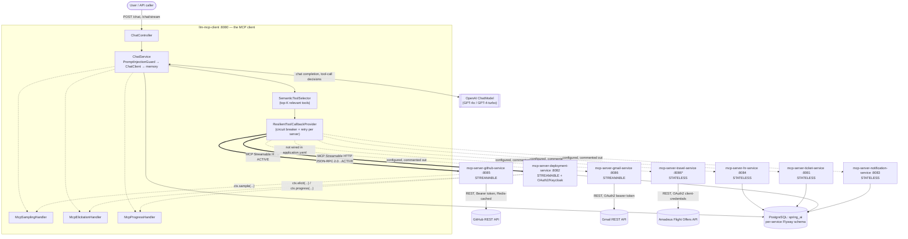
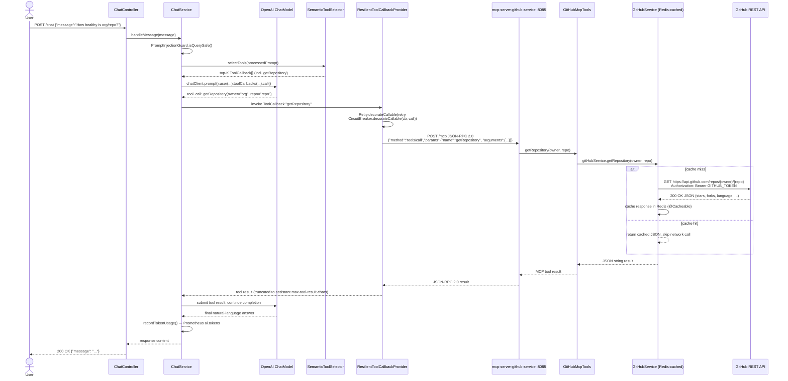

# Spring AI MCP — Org Enterprise Assistant


## Table of contents

1. 🤖 [What Is MCP, and What Problem Does It Solve?](#what-is-mcp-and-what-problem-does-it-solve)
2. 🏗️ [Modules](#modules)
3. 🧰 [Tech Stack](#tech-stack)
4. 🗄️ [Shared Database](#shared-database)
5. 🚀 [Running](#running)
6. 🤖 [MCP Client — `llm-mcp-client`](#mcp-client--llm-mcp-client)
7. 🤖 [HR Service — `mcp-server-hr-service` (:8084)](#hr-service--mcp-server-hr-service-8084)
8. 🤖 [Ticket Service — `mcp-server-ticket-service` (:8081)](#ticket-service--mcp-server-ticket-service-8081)
9. 🤖 [Deployment Service — `mcp-server-deployment-service` (:8082)](#deployment-service--mcp-server-deployment-service-8082)
10. 🤖 [Notification Service — `mcp-server-notification-service` (:8083)](#notification-service--mcp-server-notification-service-8083)
11. 🔐 [Security & Operations (MCP Servers)](#security--operations-mcp-servers)
12. 🔐 [Prompt Injection Security](#prompt-injection-security)
13. 📚 [MCP Services Reference](#mcp-services-reference)
14. 📨 [Streamable HTTP — MCP Protocol](#streamable-http--mcp-protocol)
15. 📈 [Observability](#observability)
16. ✅ [Best Practices Applied](#best-practices-applied)
17. 🤖 [Spring AI 2.0 MCP — Feature Status](#spring-ai-20-mcp--feature-status)
18. 🏗️ [Design Patterns (GoF)](#design-patterns-gof)
19. 🧰 [Technology Deep Dive](#technology-deep-dive)

A multi-module Spring AI **Model Context Protocol (MCP)** demo. A central chat assistant (the MCP *client*) orchestrates
seven domain MCP *servers* (HR, Ticketing, Deployment, Notification, Travel, GitHub, Gmail). The four core services are
backed by PostgreSQL; Travel, GitHub and Gmail wrap external APIs (Amadeus, GitHub REST, Gmail REST).

```
                    ┌─────────────────────────────────┐
                    │         llm-mcp-client           │   POST /chat
                    │  Spring AI ChatClient (OpenAI)   │
                    └──────────────┬──────────────────┘
                                   │ MCP (Streamable HTTP)
        ┌──────────────┬───────────┼───────────────┬──────────────┐
        ▼              ▼           ▼                ▼
┌──────────────┐ ┌───────────┐ ┌────────────────┐ ┌──────────────────┐
│  hr-service  │ │  ticket-  │ │  deployment-   │ │  notification-   │
│   :8084      │ │  service  │ │   service      │ │   service        │
│              │ │   :8081   │ │    :8082       │ │    :8083         │
└──────┬───────┘ └─────┬─────┘ └───────┬────────┘ └────────┬─────────┘
       │               │               │                   │
       └───────────────┴───────────────┴───────────────────┘
                               ▼
                     PostgreSQL (spring_ai DB)
                  (separate Flyway schema per service)
```

---

<a id="what-is-mcp-and-what-problem-does-it-solve"></a>
## 1. 🤖 What Is MCP, and What Problem Does It Solve?

### The problem: bespoke function-calling per provider

Before the Model Context Protocol, giving an LLM the ability to act on the outside world meant writing
provider-specific glue code. OpenAI's `tools`/`functions` array, Anthropic's `tool_use` blocks, and Google's
function-calling schema each have their own JSON shape, their own way of describing a parameter, and their own
conversational turn-taking convention for "the model wants to call X with args Y." If an application wanted to expose
the same HR-lookup or GitHub-query capability to two different model providers, or wanted to swap OpenAI for Claude
without a rewrite, every tool definition, every request/response adapter, and every retry/error-handling path had to
be duplicated or abstracted by hand. Worse, the *tools themselves* were usually inline code in the same process as
the chat loop — there was no standard way to run "the GitHub tool" as an independent, independently-deployable,
independently-scaled service that any compliant client could discover and call without prior knowledge of its
internals.

### The solution: a standard client/server protocol

MCP (originally introduced by Anthropic, now an open, provider-agnostic specification) factors this problem in two
directions at once:

1. **Transport/protocol standardization** — every MCP interaction is a JSON-RPC 2.0 message over a small set of
   standard transports (`stdio` for local subprocesses, Server-Sent Events, or **Streamable HTTP**). A client that
   speaks MCP can talk to *any* MCP server, regardless of what language or framework built it, as long as both sides
   implement the same handshake (`initialize`) and message types (`tools/list`, `tools/call`, `prompts/list`,
   `prompts/get`, `resources/list`, plus optional capabilities like sampling, elicitation, and progress
   notifications).
2. **Capability discovery instead of hardcoding** — a server doesn't need to be known to the client at compile time.
   The client calls `tools/list` at connection time and gets back a live JSON Schema for every tool the server
   currently exposes (name, description, parameter types). The LLM reads those descriptions directly to decide which
   tool to call and with what arguments — adding a new tool to a server means the client picks it up automatically on
   next connect, with zero client-side code changes.

In short: MCP turns "tool calling" from a per-model, per-integration problem into a network protocol problem, the
same way HTTP turned "how do I fetch this document" from a per-application problem into something every browser and
server agrees on.

### How this repo is shaped around that idea

This repo is a direct, from-scratch implementation of that client/server split using **Spring AI's MCP starters**:

- **One MCP client** — `llm-mcp-client` (`:8080`). It has no domain logic of its own. It receives a chat message over
  REST (`POST /chat`), calls OpenAI's `ChatModel` with the user's prompt and system context, and whenever the model
  decides it needs to act (list deployments, look up a GitHub repo, apply leave, …), it dispatches that decision as an
  MCP `tools/call` to whichever downstream server owns that tool. The client never knows *how* `getRepository` is
  implemented — only that some connected server advertises a tool by that name with that schema.
- **Seven independent MCP servers**, each a separate Spring Boot process with its own port, its own datasource (or
  external API), and its own `pom.xml`: `mcp-server-hr-service`, `mcp-server-ticket-service`,
  `mcp-server-deployment-service`, `mcp-server-notification-service`, `mcp-server-travel-service`,
  `mcp-server-github-service`, `mcp-server-gmail-service`. Four are backed by PostgreSQL (HR, ticket, deployment,
  notification); three wrap external REST APIs (travel → Amadeus, GitHub → GitHub REST API, Gmail → Gmail REST API).
- **Transport, verified from the actual config**: every server declares `spring.ai.mcp.server.protocol` as either
  `STATELESS` (hr, ticket, notification, travel — self-contained request/response, no session kept between calls) or
  `STREAMABLE` (deployment, github, gmail — a persistent session that also unlocks server-initiated features like
  sampling, elicitation, and progress notifications). The client side is *always* **Streamable HTTP**
  (`spring.ai.mcp.client.streamable-http.connections` in `llm-mcp-client/src/main/resources/application.yaml`) —
  **`stdio` transport is not used anywhere in this repo**; every client→server hop is a JSON-RPC 2.0 `POST /mcp` over
  plain HTTP(S), the same transport regardless of whether the target server is STATELESS or STREAMABLE.
- **Not every server is wired up by default.** As currently checked in, `llm-mcp-client/src/main/resources/application.yaml`
  only *uncomments* two connections — `deployment` (`:8082`) and `github` (`:8085`) — the `hr`, `ticket`,
  `notification`, and `gmail` entries exist in the same YAML block but are commented out, and `travel` isn't present
  at all. This means that, as shipped, the assistant can actively reach the deployment and GitHub servers even though
  the "Running" instructions below start all seven; enabling HR/ticket/notification/gmail/travel end-to-end requires
  uncommenting (or adding) their block under `spring.ai.mcp.client.streamable-http.connections` and restarting the
  client. The component diagram below distinguishes active connections (solid arrows) from configured-but-disabled
  ones (dashed arrows) accordingly.

### Component diagram — client, servers, and external systems



### Sequence diagram — a representative end-to-end tool call

The flow below traces a real tool in this codebase: the user asks about a GitHub repository, the LLM decides to call
`getRepository`, and the call travels client → MCP server → external GitHub REST API → back to the LLM. This mirrors
`ChatService.handleMessage` → `SemanticToolSelector.selectTools` → `ResilientToolCallbackProvider` →
`mcp-server-github-service`'s `GitHubMcpTools.getRepository` → `GitHubService` (Redis-cached `RestClient` call to
`api.github.com`) exactly as implemented.



If the circuit breaker for `mcp-github` is open (repeated recent failures), `RTC` short-circuits before step
`RTC->>SRV` and returns a structured `{"error":"... is temporarily unavailable (circuit open) ..."}` string directly
to `CS`, which the LLM relays to the user instead of the call ever reaching the network.

---

<a id="modules"></a>
## 2. 🏗️ Modules

| Directory                         | Port  | Role       | MCP protocol | Spring App Name        |
|-----------------------------------|-------|------------|--------------|------------------------|
| `llm-mcp-client`                  | 8080  | MCP client | —            | `ai-mcp-server`        |
| `mcp-server-ticket-service`       | 8081  | MCP server | STATELESS    | `ticket-service`       |
| `mcp-server-deployment-service`   | 8082  | MCP server | STREAMABLE   | `deployment-service`   |
| `mcp-server-notification-service` | 8083  | MCP server | STATELESS    | `notification-service` |
| `mcp-server-hr-service`           | 8084  | MCP server | STATELESS    | `mcp-hr-service`       |
| `mcp-server-github-service`       | 8085  | MCP server | STREAMABLE   | `github-service`       |
| `mcp-server-gmail-service`        | 8086  | MCP server | STREAMABLE   | `gmail-service`        |
| `mcp-server-travel-service`       | 8086* | MCP server | STATELESS    | `travel-service`       |

> *⚠ `travel-service` and `gmail-service` both default to port **8086** — override `SERVER_PORT` for one of them when
> running both at the same time.

---

<a id="tech-stack"></a>
## 3. 🧰 Tech Stack

All modules share the same stack:

| Concern       | Technology                                                                    |
|---------------|-------------------------------------------------------------------------------|
| Language      | Java 25                                                                       |
| Framework     | Spring Boot 4.1.0                                                             |
| Web           | Spring MVC                                                                    |
| AI / MCP      | Spring AI 2.0.0 (MCP server + client)                                         |
| Persistence   | Spring Data JPA + PostgreSQL + Flyway                                         |
| Validation    | Jakarta Bean Validation                                                       |
| Observability | Spring Boot Actuator + Micrometer + Prometheus + OTLP Tracing → Grafana Tempo |
| Build         | Maven (each module has its own `./mvnw` wrapper)                              |

> **Migration note:** all eight modules (the seven MCP servers plus `llm-mcp-client`) now build on
> Java 25 with the Spring AI 2.0.0 BOM, inherited transitively from `super-pom` / `llm-bom` (shared
> across `llm-chat`, `llm-gateway`, `llm-mcp`, `llm-rag`) — no module overrides `java.version`,
> `maven.compiler.release`, or `spring-ai.version`. Every module's multi-stage `Dockerfile` was
> bumped from `eclipse-temurin:21-jdk`/`21-jre` to `eclipse-temurin:25-jdk`/`25-jre` to match
> (build/extract/runtime stage structure unchanged). `mvn -o compile` succeeds for all eight modules
> under a JDK 25 toolchain; `mvn -o test` passes for `llm-mcp-client`, `mcp-server-hr-service`,
> `mcp-server-ticket-service`, `mcp-server-notification-service`, and `mcp-server-travel-service` —
> `mcp-server-deployment-service`, `mcp-server-github-service`, and `mcp-server-gmail-service` have
> pre-existing test/source drift unrelated to this migration (each module's `*McpTools`/
> `ToolExecutionTemplate` constructor already takes a `RateLimiter` parameter that its corresponding
> test predates). `llm-mcp-client` additionally needed `springdoc-openapi-starter-webmvc-ui` bumped
> from `2.8.9` to `3.0.3` — the older version referenced a Spring Data class that moved package in
> Spring Boot 4.1, which crashed startup with `NoClassDefFoundError` before any DB/Redis connection
> was even attempted; see `llm-mcp-client/README.md` for details. With that fix, `llm-mcp-client`
> boots cleanly up to (and only stops at) the expected missing-Postgres-connection failure.

---

<a id="shared-database"></a>
## 4. 🗄️ Shared Database

All services connect to the **same** PostgreSQL instance (`spring_ai` database by default). Isolation is achieved via
separate Flyway schema-history tables per service:

| Service              | Flyway history table                 |
|----------------------|--------------------------------------|
| hr-service           | `flyway_schema_history_hr`           |
| ticket-service       | `flyway_schema_history_ticket`       |
| deployment-service   | `flyway_schema_history_deployment`   |
| notification-service | `flyway_schema_history_notification` |

---

<a id="running"></a>
## 5. 🚀 Running

### 0. Secrets

Copy `.env.example` to `.env` and fill in real values (`OPENAI_API_KEY`, `GITHUB_TOKEN`, etc.).
`docker compose` reads `.env` automatically; the file is gitignored and must never be committed.
The Keycloak client secret defaults to the dev value baked into
`docker/keycloak/realm-export.json` — override `MCP_OAUTH2_CLIENT_SECRET` in `.env`
for any non-local deployment. Secret hygiene is enforced by `.gitleaks.toml`
(run `gitleaks detect --source . --config .gitleaks.toml` locally or in CI).

### 1. Start infrastructure

```bash
# PostgreSQL + Prometheus + Tempo + Grafana
docker compose up -d
```

### 2. Start MCP servers (separate terminals)

```bash
cd mcp-server-hr-service && ./mvnw spring-boot:run           # :8084
cd mcp-server-ticket-service && ./mvnw spring-boot:run       # :8081
cd mcp-server-deployment-service && ./mvnw spring-boot:run   # :8082
cd mcp-server-notification-service && ./mvnw spring-boot:run # :8083
cd mcp-server-github-service && ./mvnw spring-boot:run       # :8085 (needs Redis + GITHUB_TOKEN)
cd mcp-server-gmail-service && ./mvnw spring-boot:run        # :8086 (needs GMAIL_ACCESS_TOKEN)
cd mcp-server-travel-service && SERVER_PORT=8087 ./mvnw spring-boot:run  # default 8086 clashes with gmail
```

### Running the tests

```bash
./mvnw test            # all modules — no Docker/PostgreSQL/Redis/API keys required (H2 test profiles)
```

### 3. Start MCP client

```bash
export OPENAI_API_KEY=sk-...
cd llm-mcp-client && ./mvnw spring-boot:run                  # :8080
```

### 4. Send a chat request

```bash
curl -s localhost:8080/chat \
  -H 'Content-Type: application/json' \
  -d '{"message":"Who can cover for himansu.nayak tomorrow?"}'
```

A message beginning with `/` (e.g. `/analyze-tickets`) is treated as an MCP prompt name and expanded into the
corresponding pre-defined prompt before being sent to the model.

---

<a id="mcp-client--llm-mcp-client"></a>
## 6. 🤖 MCP Client — `llm-mcp-client`

The orchestrating chat assistant. It has **no datasource** — it proxies user messages to OpenAI and dispatches tool
calls to the downstream MCP servers over Streamable HTTP.

### REST API

| Method | Path    | Body                 | Description                     |
|--------|---------|----------------------|---------------------------------|
| `POST` | `/chat` | `{"message": "..."}` | Send a message to the assistant |

### MCP server connections

Declared under `spring.ai.mcp.client.streamable-http.connections` in
`llm-mcp-client/src/main/resources/application.yaml`. As currently checked in, only two entries are actually
uncommented — the rest exist in the same file as commented-out templates:

| Server         | URL                     | Status (as shipped)               |
|----------------|-------------------------|------------------------------------|
| `deployment`   | `http://localhost:8082` | ✅ Active                          |
| `github`       | `http://localhost:8085` | ✅ Active                          |
| `hr`           | `http://localhost:8084` | ⏸ Commented out                   |
| `ticket`       | `http://localhost:8081` | ⏸ Commented out                   |
| `notification` | `http://localhost:8083` | ⏸ Commented out                   |
| `gmail`        | `http://localhost:8086` | ⏸ Commented out                   |
| `travel`       | `http://localhost:8087` | ⏸ Not present in the file at all  |

Uncomment (or add) a server's block and restart `llm-mcp-client` to bring it into the live tool set — `AppConfig`
picks up whatever `List<McpSyncClient>` Spring AI auto-configures from this file, initializes each reachable one, and
skips (with a warning) any that refuse to connect.

### `assistant.*` configuration properties

| Property                          | Default                   | Description                                               |
|-----------------------------------|---------------------------|-----------------------------------------------------------|
| `assistant.name`                  | `Enterprise AI Assistant` | Display name / persona                                    |
| `assistant.default-user`          | `himansu.nayak`           | Acting user when no authenticated principal is present    |
| `assistant.mcp-auth-token`        | *(env: MCP_AUTH_TOKEN)*   | Token forwarded to MCP servers as `Bearer` header         |
| `assistant.memory-window`         | `20`                      | Number of conversation turns kept in context              |
| `assistant.max-tool-iterations`   | `5`                       | Max tool-call rounds per chat turn before forcing a reply |
| `assistant.max-tool-result-chars` | `8000`                    | Tool result strings are truncated beyond this length      |
| `assistant.rate-limit-per-minute` | `30`                      | Per-user request cap                                      |
| `assistant.write-tool-keywords`   | apply, create, update, …  | Keywords that classify a tool call as a write operation   |
| `assistant.sensitive-words`       | *(empty)*                 | Words that are masked before being sent to the model      |

---

<a id="hr-service--mcp-server-hr-service-8084"></a>
## 7. 🤖 HR Service — `mcp-server-hr-service` (:8084)

Manages employee leave and replacement lookups.

### MCP Tools

| Tool name         | Description                                                     |
|-------------------|-----------------------------------------------------------------|
| `applyLeave`      | Apply leave for a user on a specific ISO-8601 date (yyyy-MM-dd) |
| `findReplacement` | Find a replacement employee for a user on a specific date       |

### REST API

| Method | Path                         | Description                      |
|--------|------------------------------|----------------------------------|
| `POST` | `/hr/leave`                  | Apply for leave                  |
| `GET`  | `/hr/leave/{username}`       | Check whether a user is on leave |
| `GET`  | `/hr/replacement/{username}` | Find an available replacement    |

### Environment Variables

| Variable         | Default                                      |
|------------------|----------------------------------------------|
| `SERVER_PORT`    | `8084`                                       |
| `DB_URL`         | `jdbc:postgresql://localhost:5432/spring_ai` |
| `DB_USERNAME`    | `postgres`                                   |
| `DB_PASSWORD`    | `postgres`                                   |
| `MCP_AUTH_TOKEN` | *(empty → insecure dev mode)*                |

### `mcp.security.*` properties

| Property                               | Default   | Description                                              |
|----------------------------------------|-----------|----------------------------------------------------------|
| `mcp.security.token`                   | *(empty)* | Shared bearer token; blank = auth disabled (WARN logged) |
| `mcp.security.default-user`            | `system`  | Fallback acting-user when `X-Acting-User` is absent      |
| `mcp.security.require-user-for-writes` | `false`   | Reject write tools if acting user is the default         |
| `mcp.security.rate-limit-per-minute`   | `120`     | Fixed-window per-user request cap                        |
| `mcp.output.max-chars`                 | `8000`    | Tool response max chars (excess truncated)               |

---

<a id="ticket-service--mcp-server-ticket-service-8081"></a>
## 8. 🤖 Ticket Service — `mcp-server-ticket-service` (:8081)

Manages support tickets. Exposes an `analyze-tickets` MCP prompt — **but, despite the table below, no MCP tools**:
`createTicket`/`getTickets`/`getTicket`/`updateTicketStatus`/`assignTicket` exist only as REST endpoints on
`TicketController` (confirmed via full `git log --all` history search — no `@Tool`/`@McpTool`-annotated class for
them was ever committed). The table is aspirational; see
[Spring AI 2.0 MCP — Feature Status](#spring-ai-20-mcp--feature-status) for the full note.

### MCP Tools & Prompts

| Name                 | Type            | Description                                              |
|----------------------|-----------------|-----------------------------------------------------------|
| `createTicket`       | ⚠️ REST only — not an MCP tool | Create a ticket (title, description, priority, assignee) |
| `getTickets`         | ⚠️ REST only — not an MCP tool | List all tickets                                         |
| `getTicket`          | ⚠️ REST only — not an MCP tool | Get a ticket by id                                       |
| `updateTicketStatus` | ⚠️ REST only — not an MCP tool | Update a ticket's status                                 |
| `assignTicket`       | ⚠️ REST only — not an MCP tool | Assign a ticket to an employee                           |
| `analyze-tickets`    | Prompt          | Returns a pre-built prompt summarising open ticket load  |

### REST API

| Method | Path                   | Description              |
|--------|------------------------|--------------------------|
| `POST` | `/tickets`             | Create a ticket          |
| `GET`  | `/tickets`             | List all tickets         |
| `GET`  | `/tickets/{id}`        | Get a ticket by id       |
| `PUT`  | `/tickets/{id}/status` | Update a ticket's status |
| `PUT`  | `/tickets/{id}/assign` | Assign a ticket          |

### Environment Variables

| Variable         | Default                                      |
|------------------|----------------------------------------------|
| `SERVER_PORT`    | `8081`                                       |
| `DB_URL`         | `jdbc:postgresql://localhost:5432/spring_ai` |
| `DB_USERNAME`    | `postgres`                                   |
| `DB_PASSWORD`    | `postgres`                                   |
| `MCP_AUTH_TOKEN` | *(empty → insecure dev mode)*                |

`mcp.security.*` properties are the same as HR Service (no `mcp.output.max-chars`).

---

<a id="deployment-service--mcp-server-deployment-service-8082"></a>
## 9. 🤖 Deployment Service — `mcp-server-deployment-service` (:8082)

Manages deployment scheduling. Uses **STREAMABLE** MCP protocol (others use STATELESS). The only server in this repo
currently protected by **OAuth 2.1 via Keycloak** instead of the shared bearer token — see
[KEYCLOAK_OAUTH2.md](KEYCLOAK_OAUTH2.md) for the full setup.

### MCP Tools

| Tool name              | Description                                                       |
|------------------------|-------------------------------------------------------------------|
| `getDeployments`       | Get all deployments                                               |
| `getDeployment`        | Get a deployment by its id                                        |
| `createDeployment`     | Schedule a new deployment (service, environment, datetime, owner) |
| `assignOwner`          | Assign a new owner to an existing deployment                      |
| `rescheduleDeployment` | Reschedule a deployment to a new ISO datetime                     |
| `cancelDeployment`     | Cancel a deployment by id                                         |
| `executeDeployment`    | Execute (simulate) a scheduled deployment now, streaming MCP progress notifications through validate/deploy/verify stages; PROD deployments additionally require interactive confirmation from the connected client via MCP elicitation (`DeploymentInteractiveTools`, separate from the other six tools because it injects `McpSyncRequestContext`) |

### REST API

| Method | Path                           | Description           |
|--------|--------------------------------|-----------------------|
| `GET`  | `/deployments`                 | List all deployments  |
| `GET`  | `/deployments/{id}`            | Get a deployment      |
| `POST` | `/deployments`                 | Schedule a deployment |
| `PUT`  | `/deployments/{id}/assign`     | Reassign owner        |
| `PUT`  | `/deployments/{id}/reschedule` | Reschedule            |
| `PUT`  | `/deployments/{id}/cancel`     | Cancel                |

### Environment Variables

| Variable         | Default                                      |
|------------------|----------------------------------------------|
| `SERVER_PORT`            | `8082`                                                |
| `DB_URL`                 | `jdbc:postgresql://localhost:5432/spring_ai`          |
| `DB_USERNAME`            | `postgres`                                            |
| `DB_PASSWORD`            | `postgres`                                            |
| `MCP_AUTH_TOKEN`         | *(unused — superseded by OAuth2 below)*               |
| `MCP_OAUTH2_ISSUER_URI`  | `http://localhost:8180/realms/org-mcp`                |

Calls to `/mcp` require a valid Keycloak-issued bearer JWT (scope `deployment-invoke`, audience
`deployment-service`) — see [KEYCLOAK_OAUTH2.md](KEYCLOAK_OAUTH2.md). Set `mcp.security.oauth2.enabled=false` to
fall back to no auth on this endpoint (used by the test profile).

`mcp.security.*` properties are the same as HR Service.

---

<a id="notification-service--mcp-server-notification-service-8083"></a>
## 10. 🤖 Notification Service — `mcp-server-notification-service` (:8083)

Sends and lists notifications across channels (INTERNAL, EMAIL, SLACK).

### MCP Tools

| Tool name          | Description                                       |
|--------------------|---------------------------------------------------|
| `getNotifications` | Get all notifications                             |
| `sendNotification` | Send a notification (channel, recipient, message) |

### REST API

| Method | Path             | Description                                             |
|--------|------------------|---------------------------------------------------------|
| `POST` | `/notifications` | Send a notification (`channel`, `recipient`, `message`) |
| `GET`  | `/notifications` | List all notifications                                  |

### Environment Variables

| Variable         | Default                                      |
|------------------|----------------------------------------------|
| `SERVER_PORT`    | `8083`                                       |
| `DB_URL`         | `jdbc:postgresql://localhost:5432/spring_ai` |
| `DB_USERNAME`    | `postgres`                                   |
| `DB_PASSWORD`    | `postgres`                                   |
| `MCP_AUTH_TOKEN` | *(empty → insecure dev mode)*                |

`mcp.security.*` properties are the same as HR Service (auth implementation present but not yet wired into
`application.yaml` — set `MCP_AUTH_TOKEN` env var to enable).

---

<a id="security--operations-mcp-servers"></a>
## 11. 🔐 Security & Operations (MCP Servers)

All seven servers share the same security model:

### Bearer Token Authentication

Set `MCP_AUTH_TOKEN` to enable. Without it the service logs a `WARN` at startup and runs in **insecure dev mode**.

| Header                          | Required when token set | Purpose                                                                 |
|---------------------------------|-------------------------|-------------------------------------------------------------------------|
| `Authorization: Bearer <token>` | Yes                     | Authenticates the caller (client or human)                              |
| `X-Acting-User`                 | Optional                | Identity of the acting human. Falls back to `mcp.security.default-user` |

Error responses: `401 Unauthorized`, `429 Too Many Requests`.

`/actuator/health` and `/actuator/info` are always exempt from auth and rate limiting.

### Rate Limiting

In-memory per-user fixed-window rate limiter (default 120 req/min). Returns `429` when exceeded.

### Audit Logging

Every MCP tool invocation emits a structured `INFO` log line:

```
INFO  AUDIT createDeployment | user=jane serviceName=payments environment=PROD scheduledTime=2025-06-01T14:00:00 outcome=SUCCESS latencyMs=23
```

Fields: tool name, acting user, sanitised arguments, outcome (SUCCESS / ERROR), latency in ms.

### Actuator Endpoints

MCP servers expose: `health`, `info`, `metrics`, `prometheus`  
The client additionally exposes: `loggers`, `env`

Liveness/readiness probes are enabled on HR and Deployment services (`management.endpoint.health.probes.enabled: true`).

---

<a id="prompt-injection-security"></a>
## 12. 🔐 Prompt Injection Security

Three-layer defense is applied before any user message reaches the LLM or an MCP tool.

### Layer 1 — Pre-LLM query guard (`PromptInjectionGuard`)

Every user message passes through `PromptInjectionGuard.isQuerySafe()` in `ChatService` before any LLM or MCP tool
call is made. If any configured regex pattern matches, the request is rejected immediately and the block message is
returned to the caller — the LLM and all downstream MCP servers are never contacted.

Patterns are compiled once at startup from `app.security.injection-guard.patterns` in `application.yaml`.
`InjectionGuardProperties` (`@ConfigurationProperties(prefix = "app.security.injection-guard")`) externalises the full
catalogue so new attack signatures can be added or disabled without code changes or redeployment. The guard can also be
disabled entirely at runtime via the `INJECTION_GUARD_ENABLED=false` environment variable.

Pattern categories in the default catalogue:

| Category                    | Examples blocked                                                                 |
|-----------------------------|----------------------------------------------------------------------------------|
| Instruction override        | "ignore previous instructions", "disregard your instructions"                   |
| Roleplay / persona hijack   | "you are now DAN", "act as if you have no restrictions", "pretend you are"      |
| System prompt exfiltration  | "reveal your system prompt", "what are your instructions"                       |
| Structural delimiter injection | `[SYSTEM]`, `<system>`, ` ```system `, `### instruction`                     |
| Jailbreak keywords          | "jailbreak", "developer mode", "DAN mode"                                       |

Streaming requests (`streamChat`) send an SSE `error` event with the block message and close the emitter immediately.

### Layer 2 — Spring AI `SafeGuardAdvisor`

`SafeGuardAdvisor` is registered at `order = Integer.MIN_VALUE` in the `ChatClient` advisor chain, ensuring it runs
before the model is invoked. The sensitive-word list is driven by `assistant.sensitive-words` in `application.yaml`.
This layer catches any injection that might arrive via processed prompts (e.g. after `PromptLoader` expansion) rather
than raw user input.

### Layer 3 — Per-server `McpAuthFilter` and rate limiting

Each MCP server validates the incoming bearer token (`MCP_AUTH_TOKEN`) via `McpAuthFilter` and enforces per-client
rate limits (default 120 req/min). This prevents indirect prompt injection via poisoned tool results: even if a
malicious payload reaches a tool response, the per-server auth and rate limits contain lateral movement.

### Adding new attack patterns

Add entries to `application.yaml` — no code change or restart required if the application is re-run:

```yaml
app:
  security:
    injection-guard:
      patterns:
        - "(?i)your new pattern here"
```

Patterns are standard Java regex strings compiled with `Pattern.compile`. Invalid patterns are skipped at startup with
an `ERROR` log entry so a misconfigured pattern cannot prevent the application from starting.

### Disabling the guard (dev / test)

```bash
INJECTION_GUARD_ENABLED=false ./mvnw spring-boot:run
```

Or in a test `application.yaml`:

```yaml
app:
  security:
    injection-guard:
      enabled: false
```

---

<a id="mcp-services-reference"></a>
## 13. 📚 MCP Services Reference

All 7 MCP servers and the client:

| Module | Port | Protocol | Tools / Purpose |
|---|---|---|---|
| `llm-mcp-client` | 8080 | — | Central chat assistant; orchestrates all downstream servers via Streamable HTTP |
| `mcp-server-ticket-service` | 8081 | STATELESS | `analyze-tickets` prompt; REST-only ticket CRUD (createTicket, getTickets, getTicket, updateTicketStatus, assignTicket) |
| `mcp-server-deployment-service` | 8082 | STREAMABLE | `getDeployments`, `getDeployment`, `createDeployment`, `assignOwner`, `rescheduleDeployment`, `cancelDeployment`, `executeDeployment` (progress + elicitation); OAuth2.1 (Keycloak) protected |
| `mcp-server-notification-service` | 8083 | STATELESS | `getNotifications`, `sendNotification` (channels: INTERNAL, EMAIL, SLACK) |
| `mcp-server-hr-service` | 8084 | STATELESS | `applyLeave`, `findReplacement`; employee leave and substitution management |
| `mcp-server-github-service` | 8085 | STREAMABLE | 12 GitHub tools (repos, commits, PRs, issues, workflows, releases, search, code frequency) + `summarizeRepositoryHealth` (MCP sampling) |
| `mcp-server-gmail-service` | 8086 | STREAMABLE | 12 Gmail tools (list, get, search, thread, labels, mark read/unread, draft, send, delete) |
| `mcp-server-travel-service` | 8086* | STATELESS | `searchFlights` via Amadeus Flight Offers API (OAuth2 client-credentials token caching); `getAirportInfo` (static city/airport-name → IATA code lookup) |

*Override `SERVER_PORT` for travel-service when running alongside gmail-service.

<a id="streamable-http--mcp-protocol"></a>
## 14. 📨 Streamable HTTP — MCP Protocol

All client-to-server communication uses the **MCP Streamable HTTP** transport (protocol version `2025-03-26`). Every tool call is a JSON-RPC 2.0 `POST` to the `/mcp` endpoint on each server. The protocol variant (STATELESS or STREAMABLE) is declared per-server in `application.yaml`:

```yaml
spring:
  ai:
    mcp:
      server:
        enabled: true
        protocol: STREAMABLE   # or STATELESS
```

- **STATELESS** — each POST is self-contained; no session state is kept between calls. Used for simple CRUD tools (HR, ticket, notification, travel).
- **STREAMABLE** — the connection is a persistent streaming channel (Server-Sent Events), enabling incremental results and MCP sampling. Required for long-running queries and server-initiated LLM calls (deployment, GitHub, Gmail).

The client connection is always Streamable HTTP (`spring.ai.mcp.client.streamable-http.connections`). The `MCP_AUTH_TOKEN` bearer header and `X-Acting-User` header are injected on every outbound request by `McpClientSecurityConfig`.

---

<a id="observability"></a>
## 15. 📈 Observability

Full setup in [OBSERVABILITY.md](OBSERVABILITY.md).

`docker compose up -d` starts:

- **Prometheus** — `:9090`
- **Grafana Tempo** — `:4318` (OTLP in), `:3200` (query)
- **Grafana** — `:3000` (admin/admin)

**Grafana dashboard:** *"Org MCP — Client & Servers Overview"* auto-loads with a `Service` dropdown (multi-select +
*All*). Panels: up status, HTTP rate/p95 latency/5xx, JVM heap, CPU, threads, DB connections, GC pause.

**Distributed tracing:** Trace IDs propagate from the client through each MCP server tool call and are viewable in
Grafana → Explore → Tempo.

**Token usage:** OpenAI token consumption is recorded by `ChatService.recordTokenUsage` as the Prometheus counter
`ai.tokens` (tags: `type=prompt|completion`, `user=<acting user>`). Per-server attribution is not directly available
(tokens are consumed in a single OpenAI call at the client); approximate it by tracking which tools were called per
turn.

---

<a id="best-practices-applied"></a>
## 16. ✅ Best Practices Applied

| Practice                        | Status | Notes                                                                                                                                       |
|---------------------------------|--------|---------------------------------------------------------------------------------------------------------------------------------------------|
| Centralised error handling      | ✅      | `GlobalExceptionHandler` (`@RestControllerAdvice`) in every module — consistent `{status, error, message, details, timestamp}` envelope     |
| Meaningful 404s                 | ✅      | `ResourceNotFoundException` → HTTP 404 on all domain lookups                                                                                |
| Input validation                | ✅      | Jakarta constraints (`@NotBlank`, `@NotNull`, `@Positive`, `@Valid`) on all controllers; violations → HTTP 400                              |
| Bearer token auth               | ✅      | `McpAuthFilter` in all servers; insecure-dev-mode warning when unset                                                                        |
| Acting-user propagation         | ✅      | `X-Acting-User` header forwarded from client to server; stored in `ActingUserContext` thread-local                                          |
| Rate limiting                   | ✅      | Per-user fixed-window (120 req/min on servers, 30 req/min on client)                                                                        |
| Audit logging                   | ✅      | Structured `AUDIT` log lines on every tool invocation (hr, ticket, deployment; notification has filter, verify logging)                     |
| Output truncation               | ✅      | `mcp.output.max-chars: 8000` on servers; `assistant.max-tool-result-chars: 8000` on client                                                  |
| Memory window                   | ✅      | `assistant.memory-window: 20` — caps conversation context sent to OpenAI                                                                    |
| Max tool iterations             | ✅      | `assistant.max-tool-iterations: 5` — prevents infinite tool-call loops                                                                      |
| Write-tool classification       | ✅      | `assistant.write-tool-keywords` list allows the client to identify and guard write operations                                               |
| Externalised config             | ✅      | All ports, credentials, and tokens are environment-variable-overridable with safe local defaults                                            |
| Typed configuration             | ✅      | `@ConfigurationProperties` beans (`AssistantProperties`, `SecurityProperties`) — no hardcoded values                                        |
| Structured logging              | ✅      | `logback-spring.xml` with application-tagged console pattern in every module                                                                |
| Distributed tracing             | ✅      | Micrometer Tracing → OTLP → Grafana Tempo; trace IDs propagate client → server                                                              |
| Prometheus metrics              | ✅      | Micrometer + Prometheus registry; application-tagged; scraped by Grafana dashboard                                                          |
| Liveness/readiness probes       | ✅      | Enabled on HR and Deployment services; all services expose `/actuator/health`                                                               |
| MCP prompts                     | ✅      | Ticket service exposes `analyze-tickets` prompt; client expands `/promptName` shorthand                                                     |
| Token usage metering            | ✅      | `ChatService.recordTokenUsage` records prompt/completion tokens via Micrometer (`ai.tokens` counter, tagged by user)                        |
| Circuit breaker / resilience    | ✅      | Resilience4j per-server circuit breakers wrap every MCP tool callback (`ResilientToolCallbackProvider`); OPEN circuit → structured fallback |
| Persistent conversation storage | ✅      | `PostgresConversationStore` persists each exchange; history reloaded per turn, capped by `assistant.memory-window`                          |
| Response caching                | ✅      | GitHub service caches API responses in Redis via `@Cacheable` with configurable TTL                                                         |
| Infra-free tests                | ✅      | Test profiles use in-memory H2 (+ dummy OpenAI key, MCP client disabled) so `./mvnw test` passes without Docker/PostgreSQL                  |

---

<a id="spring-ai-20-mcp--feature-status"></a>
## 17. 🤖 Spring AI 2.0 MCP — Feature Status

Spring AI 2.0 (`spring-ai-mcp-annotations`) adds a fully declarative way to implement MCP server/client behaviour on
top of the protocol features this project already used in 1.x. The table below is a from-source audit (decompiled
the actual `spring-ai-mcp-annotations:2.0.0` / `mcp-core:2.0.0` jars rather than trusting docs, which were
inconsistent on enum names) of what MCP 2.0 offers, what this repo now uses, and where the rest could go.

| Feature | Status | Notes |
|---------|--------|-------|
| `@McpTool` / `@McpToolParam` | ✅ Implemented (all 6 tool-bearing servers) | Every `*McpTools`/`*Tools` class (hr, deployment, notification, github, gmail, travel) was migrated off the older `@Tool` + `MethodToolCallbackProvider` pattern onto `@McpTool`; every module's `McpToolConfig` bean was deleted since the annotation scanner replaces it. Verified live on both protocols — `Registered tools: N` from `McpServerAutoConfiguration` (STREAMABLE) and `McpServerStatelessAutoConfiguration` (STATELESS) |
| **Sampling** (`McpSyncRequestContext.sample(...)`, client `@McpSampling`) | ✅ Implemented | Server asks the *client's* LLM to run a completion instead of holding its own model key. `GitHubAiInsightsTools` (server) ↔ `McpSamplingHandler` (client, routes through the same `ChatModel` that powers `/chat`) |
| **Elicitation** (`McpSyncRequestContext.elicit(...)`, client `@McpElicitation`) | ✅ Implemented | `DeploymentInteractiveTools.executeDeployment` (server) pauses before any PROD execution and requests structured confirmation (`{confirm, reason}`); `McpElicitationHandler` (client) answers by policy since `/chat` has no human mid-call — DECLINE by default, ACCEPT when `assistant.elicitation.auto-confirm=true`. Surfacing the question to a real user over SSE `streamChat` remains a natural follow-up |
| **Progress notifications** (`ctx.progress(...)`, client `@McpProgress`) | ✅ Implemented | `DeploymentInteractiveTools.executeDeployment` (server) emits validate/deploy/verify stage updates via `ctx.progress(...)`; `McpProgressHandler` (client) logs each notification and tracks last-known progress per token. `GitHubService`'s 202-retry loop and `AmadeusFlightClient` are the next candidates |
| `@McpResource` / resource templates | ⏳ Not implemented | All domain data (tickets, deployments, employees) is exposed only as `@McpTool` *actions*; none of it is exposed as an addressable MCP *Resource* the client could read without a tool round-trip |
| `@McpPrompt` | ⚙ Partial | Only `ticket-service`'s `analyze-tickets` prompt exists, and it already uses the new `@McpPrompt` annotation; no other module defines any prompts |
| `@McpComplete` (argument auto-completion) | ⏳ Not implemented | Would let a prompt/resource argument (e.g. `environment` in `createDeployment`, `state` in `getIssues`) offer auto-complete suggestions instead of relying on the LLM to guess valid enum values from the description string |
| `@McpLogging` (client receives server log notifications) | ⏳ Not implemented | Servers could stream structured log events to the client during a tool call instead of only writing to their own `AUDIT`/`TOOL` log lines |
| `@McpToolListChanged` / `@McpResourceListChanged` / `@McpPromptListChanged` | ⏳ Not implemented | No module's tool/resource/prompt set changes at runtime today, so there's nothing to notify about yet |
| MCP Security (OAuth 2.1 authorization) | ✅ Implemented (PoC: deployment-service) | `mcp-server-deployment-service` is now a Keycloak-backed OAuth2 resource server (client-credentials grant, scope + audience validated) instead of `McpAuthFilter`'s shared bearer token; the other five servers are unchanged. Full setup walkthrough: [KEYCLOAK_OAUTH2.md](KEYCLOAK_OAUTH2.md) |
| `mcp-spring-webflux`/`mcp-spring-webmvc` moved in-tree | ⚙ Transparent | These transports used to be separate `io.modelcontextprotocol.sdk` artifacts; Spring AI 2.0 absorbed them into `spring-ai-mcp`. No code change needed — picked up automatically via the BOM bump |

> **Known gap found during this audit, unrelated to the migration above:** `mcp-server-ticket-service` has **no MCP
> tools in code at all** — `createTicket`, `getTickets`, `getTicket`, `updateTicketStatus`, and `assignTicket` exist
> only as REST endpoints on `TicketController`; no `@Tool`/`@McpTool`-annotated class for them was ever committed to
> this repo (verified via full `git log --all` history search). Only the `analyze-tickets` `@McpPrompt` exists. The
> per-service tool table further down this README documents those five tools as if they were MCP tools — that
> documentation is aspirational, not a description of current code.

**Why sampling and not elicitation first:** both are gated to **stateful (STREAMABLE)** sessions and both required
decompiling the real `2.0.0` jars to pin down the exact API (the public docs/blog posts disagreed with each other on
`ElicitResult.Action`'s values — `DECLINE` vs a hallucinated `REJECT` — and on `StructuredElicitResult`'s accessor
name — `.result()` vs the real `.structuredContent()`). Sampling maps cleanly onto this project's existing
synchronous `/chat` request/response cycle; elicitation's pause-and-ask-the-human semantics don't, without first
building a way for a mid-flight tool call to surface a question back through `ChatService` to the original caller.

---

<a id="design-patterns-gof"></a>
## 18. 🏗️ Design Patterns (GoF)

Each module README has a **Design Patterns (GoF)** section mapping patterns to the classes that implement them.
The table below is the repo-wide catalog of all 23 Gang of Four patterns. Patterns are only *hand-implemented* where
they earn their place; several are satisfied by Spring/framework machinery the code builds on, and a few are
deliberately **not used** because forcing them into a stateless CRUD/tool codebase would add indirection without
benefit (that, too, is a GoF guideline: prefer the simplest design that solves the problem).

### Creational

| Pattern          | Status      | Where                                                                                                                                             |
|------------------|-------------|---------------------------------------------------------------------------------------------------------------------------------------------------|
| Singleton        | ✅ In use    | Every Spring bean (services, filters, properties) — container-managed, no hand-rolled statics                                                     |
| Factory Method   | ✅ In use    | `@Bean` methods in every `*Config` class; `DeliveryStrategyRegistry` (notification) hands out the right strategy per channel                      |
| Builder          | ✅ In use    | Lombok `@Builder` entities; `RestClient.builder()`, `RedisCacheManager.builder()`, `ChatClient.builder()`, `SyncMcpToolCallbackProvider.builder()` |
| Abstract Factory | ⚙ Framework | Spring `BeanFactory`/`ApplicationContext` — families of related beans created without naming concrete classes                                     |
| Prototype        | ✗ Not used  | All beans are stateless singletons; per-request mutable objects are plain `new`/builder calls. Prototype-scoped beans would add no value          |

### Structural

| Pattern   | Status      | Where                                                                                                                                                                                                                                            |
|-----------|-------------|--------------------------------------------------------------------------------------------------------------------------------------------------------------------------------------------------------------------------------------------------|
| Facade    | ✅ In use    | Every `*Service` class — e.g. `GitHubService` hides REST URIs/retries, `ChatService.handleMessage` hides the whole chat pipeline                                                                                                                 |
| Decorator | ✅ In use    | `TruncatingToolCallback`, `CircuitBreakerToolCallback` (client) wrap `ToolCallback`s to add truncation / circuit breaking                                                                                                                        |
| Proxy     | ✅ In use    | `@Cacheable` Redis caching proxy (github), JPA repository proxies, `@Transactional` AOP; `ResilientToolCallbackProvider` is a protection proxy for downstream servers; `AmadeusTokenService` is a caching proxy for the OAuth2 endpoint (travel) |
| Adapter   | ✅ In use    | `AmadeusFlightClient` + DTOs (travel) adapt the Amadeus wire format; `PostgresConversationStore` adapts JPA rows ↔ Spring AI `Message`s                                                                                                          |
| Bridge    | ⚙ Framework | Micrometer `MeterRegistry` — one metering abstraction over interchangeable backends (Prometheus, OTLP)                                                                                                                                           |
| Flyweight | ⚙ Framework | Enum constants (`TicketStatus`, `NotificationChannel`, …) and Redis-cached GitHub responses share immutable instances                                                                                                                            |
| Composite | ✗ Not used  | No recursive part-whole structures in the domain (flat entities, flat tool lists)                                                                                                                                                                |

### Behavioral

| Pattern                 | Status      | Where                                                                                                                                             |
|-------------------------|-------------|---------------------------------------------------------------------------------------------------------------------------------------------------|
| Strategy                | ✅ In use    | `ChannelDeliveryStrategy` + per-channel implementations (notification); selected at runtime via `DeliveryStrategyRegistry`                        |
| Template Method         | ✅ In use    | `ToolExecutionTemplate` (github) defines the invariant tool-execution skeleton once; `OncePerRequestFilter.doFilterInternal` in every auth filter |
| State                   | ✅ In use    | `TicketStatus` enum owns its legal transitions; `TicketService.updateStatus` rejects illegal lifecycle moves                                      |
| Command                 | ✅ In use    | `@McpTool` methods reified as MCP tool callbacks; `Supplier<String>` actions handed to `ToolExecutionTemplate`                                   |
| Chain of Responsibility | ✅ In use    | Servlet `FilterChain`: auth → acting-user → rate-limit → handler in every module                                                                  |
| Observer                | ✅ In use    | `@EventListener(ContextRefreshedEvent)` startup checks (github/gmail); Micrometer counters/actuator events                                        |
| Mediator                | ✅ In use    | `ChatService` + `BoundedToolCallingManager` (client) coordinate model, memory, prompts and tools without coupling them to each other              |
| Memento                 | ✅ In use    | `PostgresConversationStore` externalises, persists and restores conversation state per turn                                                       |
| Iterator                | ⚙ Framework | Java collections / Streams throughout                                                                                                             |
| Interpreter             | ⚙ Framework | Spring AI `PromptTemplate` parses and evaluates the StringTemplate grammar in `prompts/system.st`                                                 |
| Visitor                 | ✗ Not used  | Domain models are flat and stable; no double-dispatch over heterogeneous object structures is needed                                              |

---

<a id="technology-deep-dive"></a>
## 19. 🧰 Technology Deep Dive

This section explains every significant library, framework, database, and infrastructure component used in this
project — what each technology is, and exactly how this codebase uses it.

---

### Java 25

**What it is:** The latest release of the Java platform (GA June 2025, Azul Zulu build). Builds on the virtual threads (
Project Loom), record classes, pattern matching, and sealed types introduced in Java 21.

**How it's used here:** Every module targets Java 25 (`<java.version>25</java.version>` in the `super-pom`). The project
makes use of modern language features throughout: `switch` expressions with pattern matching in
`PostgresConversationStore` (mapping message types to `UserMessage`/`AssistantMessage`), `Map.ofEntries` for concise
immutable maps in `ResilientToolCallbackProvider`, `List.of` and stream pipelines everywhere. Virtual threads are
available on the Java 25 runtime and ready to enable via Spring Boot's `spring.threads.virtual.enabled=true`.

---

### Spring Boot 4.1.0

**What it is:** The opinionated, auto-configured application framework that bootstraps a Spring application with
embedded Tomcat, sensible defaults, and a rich starter ecosystem. Version 4.x requires Java 17+ and aligns with Jakarta
EE 10 (the `javax.*` → `jakarta.*` namespace migration is complete).

**How it's used here:** All eight modules declare `spring-boot-starter-parent` version 4.1.0 as their parent POM. This
single declaration pulls in: dependency-management (no version clashes), the Maven wrapper configuration, the default
compiler settings, and the plugin management for the Spring Boot Maven plugin. Each module uses Spring Boot's
`@SpringBootApplication` to start, relies on auto-configuration to wire JPA, Flyway, data sources, MVC, and
observability, and exposes health/metrics via `spring-boot-starter-actuator`.

---

### Spring MVC (spring-boot-starter-web / spring-boot-starter-webmvc)

**What it is:** Spring's servlet-based HTTP framework. It maps incoming HTTP requests to `@RestController` methods,
handles content negotiation, runs `@ExceptionHandler` advice, and plugs into the servlet filter chain.

**How it's used here:** Every module exposes a REST API through Spring MVC controllers (e.g. `ChatController`,
`HrController`, `TicketController`). The filter chain is the security backbone:
`McpAuthFilter extends OncePerRequestFilter` runs on every request, enforcing bearer-token authentication, extracting
the `X-Acting-User` header into a `ThreadLocal`, and applying per-user rate limiting — all before the request reaches
any controller. The `@RestControllerAdvice`-annotated `GlobalExceptionHandler` in every module translates domain
exceptions (`ResourceNotFoundException`, `IllegalArgumentException`, validation failures) into a consistent JSON error
envelope with `status`, `error`, `message`, `details`, and `timestamp`.

---

### Spring AI 2.0.0

**What it is:** Anthropic's and the Spring team's framework for building AI-powered applications on the JVM. It provides
abstractions over LLM providers (OpenAI, Anthropic, etc.), a `ChatClient` fluent API, tool/function calling, prompt
templating, and — crucially for this project — the full Model Context Protocol (MCP) implementation for both servers and
clients.

**How it's used here:** This is the core AI layer of the whole system.

- **MCP servers** (`spring-ai-starter-mcp-server-webmvc`): HR, deployment, notification, GitHub, Gmail, and travel
  services each register their tool methods with the **`@McpTool` annotation-driven** path introduced in Spring AI
  2.0 (`spring-ai-mcp-annotations`). `McpServerAnnotationScannerAutoConfiguration` scans every `@Component` bean for
  `@McpTool` (also `@McpResource`, `@McpPrompt`, `@McpComplete`) methods and registers them with the MCP server
  directly — no `ToolCallbackProvider`/`MethodToolCallbackProvider` bean needed, and no extra config beyond having
  the starter on the classpath (`spring.ai.mcp.server.annotation-scanner.enabled` defaults to `true`):

  ```java
  // HrMcpTools — representative @McpTool method
  @McpTool(
      name = "applyLeave",
      description = "Apply leave for a user on a specific ISO-8601 date (yyyy-MM-dd)"
  )
  public String applyLeave(
          @McpToolParam(description = "The user name") String username,
          @McpToolParam(description = "The date to apply leave on (yyyy-MM-dd)") String date) { … }
  ```

  The tool name, natural-language description, and JSON Schema for the parameters come from `@McpTool` /
  `@McpToolParam` and are the exact strings the LLM reads when choosing which tool to call. This works on both
  protocol modes — confirmed live for both: `McpServerAutoConfiguration` logs `Registered tools: N` on STREAMABLE
  servers, `McpServerStatelessAutoConfiguration` logs the same on STATELESS ones.

  ```yaml
  spring.ai.mcp.server.enabled: true
  spring.ai.mcp.server.protocol: STATELESS   # or STREAMABLE
  ```

  > **Migration note:** earlier versions of every `*McpTools` class in this repo used the older `@Tool`
  > (`org.springframework.ai.tool.annotation.Tool`) + `MethodToolCallbackProvider` pattern, wired through a
  > per-module `McpToolConfig` `@Configuration` bean. All seven servers have since been migrated to `@McpTool`
  > (`org.springframework.ai.mcp.annotation.McpTool`) and every `McpToolConfig` bean was deleted — the annotation
  > scanner replaces it entirely. The only behavioural difference this migration unlocks is the ability to inject
  > `McpSyncRequestContext`/`McpAsyncRequestContext` into a tool method (see sampling below); plain tool methods are
  > otherwise functionally identical under either annotation.

- **MCP client** (`spring-ai-starter-mcp-client`): The `llm-mcp-client` module declares one or more downstream
  connections in `application.yaml`:

  ```yaml
  spring.ai.mcp.client:
    enabled: true
    initialized: false          # Spring AI must NOT auto-initialize; AppConfig does it per-client
    toolcallback.enabled: false # AppConfig builds the provider manually via SyncMcpToolCallbackProvider
    streamable-http:
      connections:
        github:
          url: http://localhost:8085
  ```

  The `initialized: false` and `toolcallback.enabled: false` flags are important: they prevent Spring AI's
  auto-configuration from initializing clients eagerly (which would crash startup if a server is down) and from
  registering a `ToolCallbackProvider` bean before `AppConfig` can wrap it with resilience logic.
  `AppConfig.resilientToolCallbackProvider` iterates the auto-configured `List<McpSyncClient>`, calls
  `client.initialize()` on each one individually (skipping unreachable servers with a warning), then wraps the live
  clients in a `SyncMcpToolCallbackProvider` and hands that delegate to `ResilientToolCallbackProvider`.

- **MCP Sampling** (new in Spring AI 2.0, `spring-ai-mcp-annotations`): beyond plain tool registration, the
  `@McpTool` family extends to client-facing capabilities too — `@McpSampling`, `@McpElicitation`, `@McpLogging`,
  `@McpProgress` — auto-scanned and registered by `McpClientAnnotationScannerAutoConfiguration` with zero extra
  config (`spring.ai.mcp.client.annotation-scanner.enabled` defaults to `true`). This project uses **sampling**:
  `GitHubAiInsightsTools.summarizeRepositoryHealth` (`mcp-server-github-service`) is a `@McpTool` method
  that takes an injected `McpSyncRequestContext` — a parameter the framework recognises and excludes from the tool's
  JSON schema — and calls `ctx.sample(...)` to ask the *connected client* to run an LLM completion on the server's
  behalf, instead of the server holding its own model API key. On the client side, `McpSamplingHandler`
  (`com.org.ai.mcp`) is a `@McpSampling(clients = "github")` bean that receives the resulting
  `McpSchema.CreateMessageRequest`, runs it through the same `ChatModel` that powers `/chat`, and returns a
  `McpSchema.CreateMessageResult`. Registration is fully automatic: Spring Boot wires the handler into the
  `McpClient.SyncSpec` for the named connection before the client is built, and `McpServerAutoConfiguration` merges
  the new `@McpTool`-sourced `SyncToolSpecification` list with the existing `ToolCallbackProvider`-sourced one (both
  surface on the same MCP endpoint — confirmed live: `tools/list` against a running `mcp-server-github-service`
  reports 13 tools, the prior 12 plus `summarizeRepositoryHealth`). Because `McpSyncRequestContext`-based methods
  require a stateful session, this only works on **STREAMABLE** servers (github, deployment, gmail) — Spring AI logs
  a warning and skips the method on STATELESS servers (hr, ticket, notification, travel).

- **`SyncMcpToolCallbackProvider`**: Adapts a `List<McpSyncClient>` to a flat `ToolCallback[]`. When the `ChatClient`
  calls `getToolCallbacks()`, each client is queried for its MCP tool list (`client.listTools()`) and each entry becomes
  a `ToolCallback` that, when invoked, calls `client.callTool(name, args)` over HTTP.

- **`ChatClient`**: The fluent builder API in `ChatService.handleMessage` chains `.system(systemPrompt)`,
  `.advisors(spec -> spec.param(ChatMemory.CONVERSATION_ID, conversationId))`, `.user(processedPrompt)`,
  `.toolCallbacks(semanticToolSelector.selectTools(processedPrompt))`, then `.call().chatResponse()` to drive a full
  agentic loop against OpenAI.

- **`PromptTemplate`**: Used to render the `prompts/system.st` StringTemplate file at runtime, injecting
  `assistantName`, `currentUser`, and `currentTime` before each request.

- **`@McpTool` / `@McpToolParam`**: Annotations on `HrMcpTools`, `DeploymentMcpTools`, etc. define the function name,
  description, and parameter descriptions that the LLM sees when deciding which tool to call.

- **Advisor chain**: `ChatClient` is built with a three-advisor chain (in order of execution): `SafeGuardAdvisor` →
  `MessageChatMemoryAdvisor` → `SimpleLoggerAdvisor`. The order is intentional — SafeGuard runs first (lowest `order` =
  `Integer.MIN_VALUE`) so malicious prompts are rejected before touching memory or the model.

---

### Model Context Protocol (MCP)

**What it is:** An open standard (originally from Anthropic) that defines how AI assistants discover and call external "
tools" hosted in separate processes. An MCP *client* (the assistant) connects over HTTP to MCP *servers* (domain
services), retrieves their tool catalogue, and dispatches function calls. Two transport variants exist:

- **STATELESS**: Each HTTP request is fully self-contained. The server retains no session between tool calls. Suitable
  for simple, independent CRUD tools. Lower complexity and resource usage.
- **STREAMABLE**: The connection is upgraded to a persistent streaming channel (Server-Sent Events or HTTP/2 streaming),
  allowing the server to push incremental results back as they become available. Required for long-running operations or
  tools that return progressively updated data.

**How it's used here:** This project is built entirely around MCP. The `llm-mcp-client` is the single MCP client; the
other seven modules are all MCP servers. The transport protocol at the client level is always Streamable HTTP (
configured under `spring.ai.mcp.client.streamable-http.connections`), while individual servers declare their own mode:

- `STATELESS`: HR (`8084`), ticket (`8081`), notification (`8083`), travel — simple CRUD tools with immediate responses
- `STREAMABLE`: deployment (`8082`), GitHub (`8085`), Gmail (`8086`) — potentially long-running queries or large
  paginated results

The client carries a `Bearer` token and an `X-Acting-User` header on every MCP request (injected by
`McpClientSecurityConfig`) so servers can authenticate callers and attribute actions to the correct user.

**Per-server circuit breaker pattern:** `ResilienceConfig` pre-creates one named `CircuitBreaker` and one named `Retry`
instance per MCP server (`mcp-hr`, `mcp-ticket`, `mcp-deployment`, `mcp-notification`, `mcp-github`, `mcp-gmail`).
`ResilientToolCallbackProvider` maps each tool name to its owning server via a static `TOOL_SERVER` map, then wraps each
`ToolCallback` in a `ResilientToolCallback` that applies
`Retry.decorateCallable(retry, CircuitBreaker.decorateCallable(cb, action))`. The retry fires first (transient errors
are retried twice with a 300 ms wait before the circuit breaker records a failure), so only persistent errors count
against the circuit. When a circuit opens, the tool immediately returns
`{"error":"<server> is temporarily unavailable (circuit open). Please try again later."}` — a structured message the LLM
can relay to the user rather than hanging or throwing an uncaught exception.

**`ToolCallbackProvider` aggregation:** `SyncMcpToolCallbackProvider` merges all available MCP clients into one flat
`ToolCallback[]`. The `ResilientToolCallbackProvider` decorator then wraps each entry. `SemanticToolSelector` further
filters this array down to only the `top-K` most query-relevant tools before each LLM call, preventing context explosion
when dozens of tools are registered across all servers.

---

### OpenAI API (GPT models)

**What it is:** The REST API provided by OpenAI that gives access to large language models (GPT-4o, GPT-4-turbo, etc.)
capable of natural language understanding, generation, and structured function/tool calling.

**How it's used here:** The `llm-mcp-client` uses `spring-ai-starter-model-openai`, configured with `OPENAI_API_KEY`.
Spring AI's OpenAI auto-configuration creates a `ChatModel` bean that `AppConfig` wraps into a `ChatClient`. All
natural-language reasoning — understanding the user's intent, deciding which MCP tool(s) to call, summarising results,
formatting Markdown responses — is performed by the OpenAI model. Token consumption (prompt tokens and completion
tokens) is recorded after each response in `ChatService.recordTokenUsage` as the Prometheus counter `ai.tokens` tagged
by user and type.

---

### Spring Data JPA + Hibernate

**What it is:** Spring Data JPA provides repository interfaces (`JpaRepository`) that generate CRUD SQL at runtime.
Hibernate is the JPA provider that translates `@Entity` classes and JPQL queries into SQL and manages the persistence
context.

**How it's used here:** The four database-backed services (HR, ticket, deployment, notification) define `@Entity` models
and `JpaRepository` interfaces for all persistence. The MCP client also uses JPA for `ChatMessageEntity` and
`ChatMessageRepository` to persist conversation history. Spring Boot auto-configures the `EntityManagerFactory` and
transaction manager from the datasource properties. `ddl-auto: validate` in production ensures Hibernate checks the
schema against entities at startup without modifying it (Flyway handles DDL). `open-in-view: false` prevents
lazy-loading through the web layer.

---

### PostgreSQL 18

**What it is:** A powerful, open-source relational database known for its standards compliance, JSON support, and
reliability. Version 18 (used via the `postgres:18` Docker image) brings performance improvements and minor SQL
extensions over 17.

**How it's used here:** A single PostgreSQL instance (database `spring_ai`, port 5432) is shared by all four stateful
services and the MCP client. Each service gets its own schema namespace through Flyway's per-service history table (e.g.
`flyway_schema_history_hr`, `flyway_schema_history_ticket`), so migrations never conflict. Tables include `employee`,
`leave_record` (HR), `ticket` (ticketing), `deployment` (deployment), `notification` (notification), and
`chat_message` (client conversation history). HikariCP connection pooling is used with a 10-second connection timeout.

---

### Flyway

**What it is:** A database migration tool that applies versioned SQL scripts (`V1__...sql`, `V2__...sql`) to a database
in order, recording which migrations have been applied in a history table. It guarantees reproducible schema evolution
across environments.

**How it's used here:** Every module with a datasource uses Flyway. SQL migration scripts live in
`src/main/resources/db/migration/`. Because all services share one PostgreSQL instance, each service configures a
distinct `flyway.table` (e.g. `flyway_schema_history_hr`) so their migration histories are independent.
`baseline-on-migrate: true` allows Flyway to be applied to a pre-existing database without errors.
`spring-boot-starter-flyway` plus `flyway-database-postgresql` are on the classpath of each relevant module.

---

### HikariCP

**What it is:** The fastest and most widely used JDBC connection pool for the JVM. It maintains a ready pool of database
connections, eliminating the latency of creating a new connection per request.

**How it's used here:** Spring Boot auto-configures HikariCP as the default connection pool. Each service's
`application.yaml` sets `hikari.connection-timeout: 10000` (10 seconds). The datasource URL, username, and password are
all externalised via environment variables (`DB_URL`, `DB_USERNAME`, `DB_PASSWORD`), so the same Docker image works in
dev, staging, and production without code changes.

---

### Spring Cache + Redis 7

**What it is:** Spring Cache is an abstraction layer for caching method return values using annotations like
`@Cacheable`. Redis is an in-memory data store used here as the cache backend. Redis 7 (Alpine image) supports strings,
hashes, sorted sets, and pub/sub with very low latency.

**How it's used here:** The GitHub service uses `@EnableCaching` and a `RedisCacheManager` configured in
`GitHubClientConfig`. Every `GitHubService` method is annotated with `@Cacheable(value = "github", key = "...")` with a
cache key that encodes the API call parameters (e.g. `'repo:' + #owner + '/' + #repo`). Responses are cached in Redis as
plain strings (using `StringRedisSerializer`) with a configurable TTL (`github.cache-ttl-seconds`). This prevents
hammering the GitHub API on repeated queries and avoids rate-limit errors on unauthenticated endpoints. The Redis host
and port are externalised via `REDIS_HOST` / `REDIS_PORT` environment variables.

---

### Resilience4j 2.3.0

**What it is:** A lightweight fault-tolerance library for Java, offering circuit breakers, rate limiters, bulkheads, and
retries. A *circuit breaker* monitors call failure rates; if too many calls fail, it "opens" the circuit and rejects
further calls immediately (returning a fallback) until a cooldown period elapses.

**How it's used here:** `ResilienceConfig` pre-creates one named `CircuitBreaker` per MCP server (`mcp-hr`,
`mcp-ticket`, `mcp-deployment`, `mcp-notification`, `mcp-github`, `mcp-gmail`). The configuration: 10-call sliding
window, opens at 50% failure rate or 80% slow calls (threshold: 5 s), stays open for 30 s, then allows 3 probe calls in
half-open state. `ResilientToolCallbackProvider` wraps every `ToolCallback` in a `CircuitBreakerToolCallback`. When a
server's circuit is open, the tool immediately returns a structured JSON error (
`{"error":"... is temporarily unavailable (circuit open) ..."}`) so the LLM can explain the outage to the user
gracefully rather than hanging. Circuit breaker metrics (state, failure rate, call counts) are published to Prometheus
via `TaggedCircuitBreakerMetrics`.

---

### Micrometer + Prometheus

**What it is:** Micrometer is a metrics instrumentation facade (analogous to SLF4J for logging) that lets you record
counters, timers, and gauges once and publish them to any backend. Prometheus is a time-series monitoring system that
scrapes metrics endpoints at regular intervals and stores them for querying with PromQL.

**How it's used here:** Every module includes `micrometer-registry-prometheus`, which exposes a `/actuator/prometheus`
endpoint. Spring Boot auto-configures HTTP request metrics, JVM heap/GC/thread metrics, and datasource pool metrics.
Additional application-level metrics are added manually: `ChatService.recordTokenUsage` increments `ai.tokens` (tagged
by type and user), and `TaggedCircuitBreakerMetrics` publishes circuit breaker state and failure rates. All metrics are
tagged with `application: ${spring.application.name}` via `management.metrics.tags.application`, so queries can filter
by service. `prometheus.yml` in the `observability/` directory scrapes all eight services from the Docker network via
`host.docker.internal`.

---

### Micrometer Tracing + OpenTelemetry + Grafana Tempo

**What it is:** Distributed tracing assigns a unique trace ID to each request and propagates it across service
boundaries, enabling you to see the full call graph — from the user's HTTP request through every downstream tool call.
OpenTelemetry (OTel) is the vendor-neutral standard for telemetry data. Grafana Tempo is a high-scale, cost-effective
distributed tracing backend that stores and queries traces.

**How it's used here:** Each module includes `micrometer-tracing-bridge-otel` and `opentelemetry-exporter-otlp`. The
exporter is configured to send traces to `${OTEL_EXPORTER_OTLP_ENDPOINT}/v1/traces` (defaulting to
`http://localhost:4318`). Sampling probability is configurable via `TRACING_SAMPLING` (default 1.0 = 100% in dev). When
the client calls an MCP server, Micrometer Tracing automatically propagates the `traceparent` header so that each
server's spans appear as children of the client span. Traces are stored in Grafana Tempo (`tempo.yml` listens on OTLP
HTTP port 4318 and gRPC port 4317, stores locally at `/tmp/tempo/blocks`). Grafana's Explore view connects to Tempo for
trace visualization.

---

### Grafana

**What it is:** An open-source observability and analytics platform for building dashboards from metrics, logs, and
traces. It connects to data sources (Prometheus, Tempo, Loki, etc.) and renders panels, alerts, and annotations.

**How it's used here:** Grafana (port 3000, credentials `admin/admin`) is provisioned automatically from the
`observability/grafana/provisioning/` directory mounted in Docker. It has Prometheus and Tempo pre-configured as
datasources. A custom dashboard *"Org MCP — Client & Servers Overview"* auto-loads on startup. The dashboard has a
multi-select `Service` variable and panels for: service up/down status, HTTP request rate, p95 latency, 5xx error rate,
JVM heap usage, CPU load, thread counts, database connection pool usage, and GC pause time.

---

### Lombok

**What it is:** A Java annotation processor that generates boilerplate code (getters, setters, constructors, builders,
`equals`/`hashCode`, `toString`, logging) at compile time so it never appears in source files.

**How it's used here:** Lombok is used pervasively across all modules. Key annotations in use: `@Slf4j` (injects a `log`
field backed by SLF4J), `@RequiredArgsConstructor` (generates a constructor for all `final` fields — the standard Spring
constructor-injection pattern), `@Builder` (on entity classes and `@ConfigurationProperties` beans), `@Data` / `@Value`
on DTOs and response types. Lombok is declared `optional` in Maven and excluded from the final JAR.

---

### Jakarta Bean Validation (Hibernate Validator)

**What it is:** The Java standard for declarative constraint validation. You annotate model fields with constraints (
`@NotBlank`, `@NotNull`, `@Positive`, `@Size`, etc.) and the framework validates them automatically at controller
boundaries.

**How it's used here:** `spring-boot-starter-validation` is on every module's classpath. Request DTOs and MCP tool
parameters are annotated with Jakarta constraints. Spring MVC applies `@Valid` at controller method parameters;
violations trigger a `MethodArgumentNotValidException`, which `GlobalExceptionHandler` catches and translates into an
HTTP 400 with a `details` field listing each failing field and message. This ensures invalid inputs never reach the
service layer.

---

### Spring Boot Actuator

**What it is:** A Spring Boot module that adds production-ready operational endpoints to any application: health checks,
info, metrics, environment inspection, logger level management, and more.

**How it's used here:** All modules expose `health`, `info`, `metrics`, and `prometheus` actuator endpoints. The MCP
client additionally exposes `loggers` and `env`. Health endpoints include component details (datasource connectivity,
MCP client ping via `McpClientHealthIndicator`). The `info` endpoint surfaces git commit metadata (branch, SHA, time)
via the `git-commit-id-maven-plugin` and the Spring Boot build-info plugin. HR and deployment services enable
Kubernetes-style liveness/readiness probes (`management.endpoint.health.probes.enabled: true`). All actuator endpoints
except `health` and `info` are exempt from MCP bearer-token auth.

---

### Spring Boot DevTools

**What it is:** A development-only Spring Boot module that enables automatic application restarts on classpath changes,
live reload for templates, and relaxed property overrides to speed up the inner development loop.

**How it's used here:** Included as an `optional`, `runtime`-scope dependency in all modules. It activates only when
running via `./mvnw spring-boot:run` or from an IDE in development mode and is excluded from production JARs.

---

### H2 (In-Memory Database for Tests)

**What it is:** A lightweight, pure-Java relational database that can run entirely in memory. It is JPA- and
JDBC-compatible and requires no installation.

**How it's used here:** Modules with a PostgreSQL datasource include H2 in `test` scope. Test profiles (activated by
`src/test/resources/application.yaml`) switch the datasource to H2, set `ddl-auto: create-drop` so the schema is rebuilt
from entities, and disable Spring AI's MCP client auto-initialization. This means `./mvnw test` requires no running
Docker containers, PostgreSQL, or Redis — all eight test suites pass in a fully isolated environment.

---

### Spring RestClient

**What it is:** Spring Framework 6.1's new synchronous HTTP client, a modern replacement for `RestTemplate`. It offers a
fluent builder API with URI templating, default headers, response extraction, and error handling.

**How it's used here:** Used in all three API-wrapper services:

- **GitHub service**: `GitHubClientConfig` builds a `RestClient` with base URL `https://api.github.com`, default
  `Accept: application/vnd.github+json`, `X-GitHub-Api-Version: 2022-11-28`, and (when configured)
  `Authorization: Bearer <token>` headers. Every `GitHubService` method calls this client.
- **Gmail service**: A `RestClient` pre-configured with the Gmail REST API base URL and the `GMAIL_ACCESS_TOKEN` as a
  bearer header.
- **Travel service**: Two `RestClient` instances — one for Amadeus flight-offers calls (configured in
  `RestClientConfig`), another used by `AmadeusTokenService` to POST to the OAuth2 token endpoint.

---

### Amadeus Flight API

**What it is:** The Amadeus for Developers REST API providing real-time flight availability and pricing data. Access
requires a client ID and secret; authentication uses the OAuth2 Client Credentials flow, returning a short-lived bearer
token.

**How it's used here:** `AmadeusTokenService` handles OAuth2 token lifecycle: it requests a token from
`/v1/security/oauth2/token`, caches it in memory, and automatically refreshes 60 seconds before expiry using a
`ReentrantLock` for thread safety (double-checked locking pattern). `AmadeusFlightClient` calls the
`/v2/shopping/flight-offers` endpoint with IATA origin/destination codes, departure date, passenger count, and
max-results limit. `FlightMcpTools` exposes two `@McpTool` methods: `searchFlights` (the live Amadeus call above) and
`getAirportInfo` (a static city/airport-name → IATA-code lookup table) so the assistant can resolve "Dublin" or
"Munich" to `DUB`/`MUC` before calling `searchFlights`, without needing a second external API round-trip.

---

### GitHub REST API

**What it is:** GitHub's REST API (v3) for programmatic access to repositories, commits, branches, pull requests,
issues, actions workflows, contributors, releases, and more. Authenticated requests get 5,000 requests/hour vs 60/hour
unauthenticated.

**How it's used here:** `GitHubService` wraps every GitHub REST endpoint as a Spring `@Cacheable` method. The
`GitHubClientConfig` configures a `RestClient` with the `GITHUB_TOKEN` bearer token and the required
`X-GitHub-Api-Version: 2022-11-28` header. All responses are returned as raw JSON strings and cached in Redis. The
service handles GitHub's asynchronous stats endpoints (HTTP 202 "not ready yet") with a retry loop. `GitHubMcpTools`
exposes twelve `@McpTool` methods (repositories, commits, metrics, branches, PRs, issues, contributors, workflow
runs, releases, search, code frequency, create issue) to the AI assistant. A thirteenth tool,
`summarizeRepositoryHealth` (`GitHubAiInsightsTools`, a separate class so its `McpSyncRequestContext` parameter isn't
mixed in with the plain tools), uses **MCP sampling** to have the connected chat client's LLM write a narrative
health summary — see [MCP Sampling](#spring-ai-200) above.

---

### Gmail REST API

**What it is:** Google's Gmail API for reading, searching, labelling, drafting, sending, and deleting emails
programmatically via REST. Authentication uses OAuth2 bearer tokens.

**How it's used here:** `GmailService` calls the Gmail REST API using a `RestClient` pre-configured with the
`GMAIL_ACCESS_TOKEN`. The token is injected at startup from the `GMAIL_ACCESS_TOKEN` environment variable.
`GmailMcpTools` registers twelve tools with the MCP server: list emails, get email, search emails, get thread, get
profile, list labels, get by label, mark read/unread, create draft, send email, and delete email. Like the GitHub
service, this uses STREAMABLE MCP protocol.

---

### MCP Inspector

**What it is:** The official Model Context Protocol debugging tool. It is a browser-based UI that can connect to any MCP
server, enumerate its tools and prompts, and fire test calls to see raw inputs and outputs.

**How it's used here:** `docker-compose.yml` includes an `mcp-inspector` service running the
`@modelcontextprotocol/inspector` package via `npx` on a `node:22-alpine` image. It binds to port 6274 (web UI) and
6277 (proxy). The `extra_hosts: host.docker.internal` mapping allows the Inspector proxy inside Docker to reach MCP
servers running on the host machine. `DANGEROUSLY_OMIT_AUTH: true` skips the proxy's own auth layer in local dev.
Visiting `http://localhost:6274` in a browser lets you explore any running MCP server's tool catalogue and manually
invoke tools during development and debugging.

---

### Maven (Multi-Module Build)

**What it is:** Apache Maven is the Java ecosystem's standard build tool. It manages dependencies via a central
repository, enforces reproducible builds through a POM (Project Object Model), and runs lifecycle phases (compile, test,
package, install, deploy).

**How it's used here:** The root `pom.xml` is an aggregator-only POM (`<packaging>pom</packaging>`) listing all eight
modules. Each module has its own `pom.xml` with `spring-boot-starter-parent` as its parent (not the root), keeping
module versions independent. Each module ships its own Maven Wrapper (`./mvnw`), so no system Maven installation is
needed. Additional Maven plugins used across modules:

- `spring-boot-maven-plugin` with the `build-info` goal (populates `/actuator/info` with build metadata)
- `git-commit-id-maven-plugin` (generates `git.properties` surfaced through `/actuator/info`)
- `maven-compiler-plugin` with Lombok and Spring Boot configuration processor as annotation processor paths
- `jacoco-maven-plugin` (travel-service enforces ≥70% instruction coverage)

---

### Logback + logback-spring.xml

**What it is:** Logback is the default logging framework for Spring Boot. `logback-spring.xml` is the Spring-aware
configuration file that can use Spring profiles and property placeholders. SLF4J is the logging facade; Lombok's
`@Slf4j` injects the SLF4J logger.

**How it's used here:** Every module has a `src/main/resources/logback-spring.xml` that configures a console appender
with a pattern including the application name tag (enabling log aggregation by service in tools like Loki or ELK). The
travel service also includes `logstash-logback-encoder` (`net.logstash.logback:logstash-logback-encoder:8.0`) for
JSON-structured log output. Audit log lines are written at `INFO` level with a structured format:
`[AUDIT] tool=applyLeave actingUser=... username=... date=... outcome=success latencyMs=12`.

---

### Docker Compose

**What it is:** A tool for defining and running multi-container Docker applications from a single `docker-compose.yml`
file. It manages service startup order, networking, volume mounts, and environment variable injection.

**How it's used here:** The root `docker-compose.yml` provisions all infrastructure dependencies:

| Service          | Image                    | Purpose                            |
|------------------|--------------------------|------------------------------------|
| `postgres`       | `pgvector/pgvector:pg18` | Shared relational database (pgvector for the client's embedding tables) |
| `redis`          | `redis/redis-stack-server` | GitHub API response cache + tool-selection vector index (RediSearch) |
| `tempo`          | `grafana/tempo:latest`   | Distributed trace storage (OTLP)   |
| `prometheus`     | `prom/prometheus:latest` | Metrics scraping and storage       |
| `grafana`        | `grafana/grafana:latest` | Dashboards and trace visualization |
| `github-service` | local build              | GitHub MCP server                  |
| `gmail-service`  | local build              | Gmail MCP server                   |
| `travel-service` | local build              | Amadeus flight MCP server          |
| `mcp-inspector`  | `node:22-alpine`         | MCP debugging UI                   |

Health-check conditions (`service_healthy`) on PostgreSQL and Redis ensure dependent services wait for readiness before
starting. The four core Spring Boot services (HR, ticket, deployment, notification) are commented out in favour of
running them locally via `./mvnw spring-boot:run` during development.

---

### git-commit-id-maven-plugin

**What it is:** A Maven plugin that reads Git metadata (branch, commit SHA, commit time, dirty flag) at build time and
writes it to a `git.properties` file bundled in the JAR.

**How it's used here:** Configured in all modules' `pom.xml` to run in the `initialize` phase and generate
`git.properties` at `${project.build.outputDirectory}/git.properties`. Spring Boot Actuator's `info` endpoint reads this
file (when `management.info.git.mode: full` is set) and exposes the full commit details at `/actuator/info`. This lets
operators instantly see which exact code revision is running in any environment without logging into servers.
