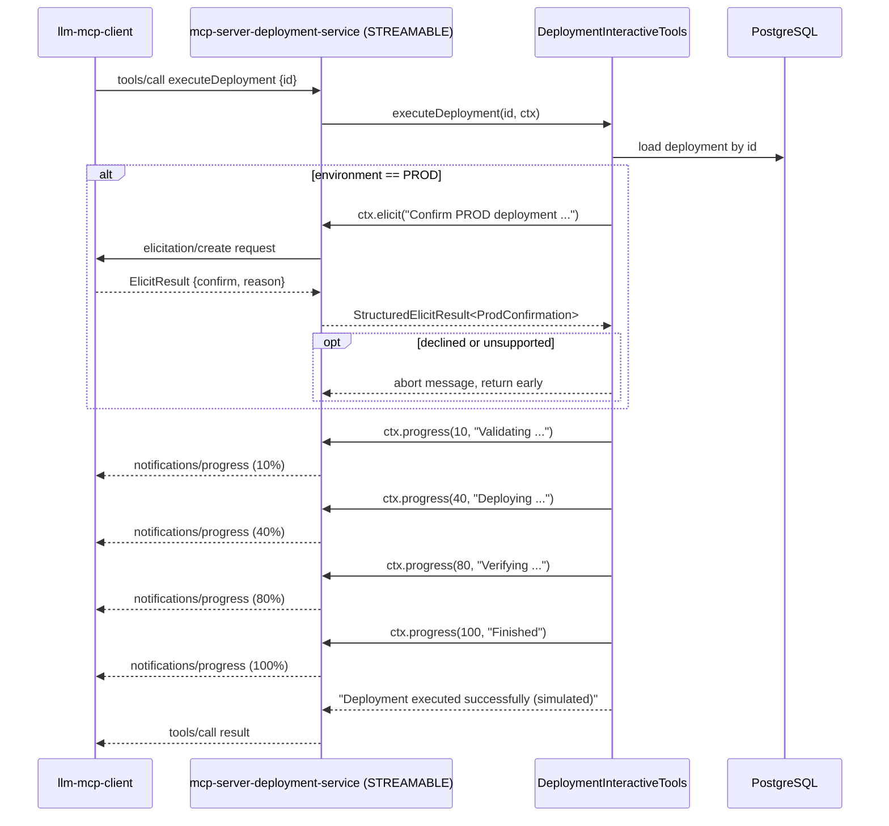

# Deployment Service — `mcp-server-deployment-service`

An MCP server that manages deployment scheduling, backed by PostgreSQL (Flyway-migrated). Runs on **`:8082`**,
MCP protocol **STREAMABLE** (shared with `mcp-server-github-service` and `mcp-server-gmail-service`; HR, ticket,
notification, and travel use STATELESS instead). STREAMABLE is required here because `executeDeployment` injects
`McpSyncRequestContext` for progress notifications and elicitation, both of which need a stateful session.

---

## MCP Tools

Six of the seven tools are defined in `DeploymentMcpTools` as `@McpTool`-annotated methods, auto-registered by Spring
AI's MCP annotation scanner (`McpServerAnnotationScannerAutoConfiguration`) — there is no `McpToolConfig` bean and no
`MethodToolCallbackProvider`; the scanner finds `@McpTool` methods on any `@Component` directly. The seventh,
`executeDeployment`, lives in a separate class, `DeploymentInteractiveTools`, because it additionally injects an
`McpSyncRequestContext` parameter (used for elicitation and progress notifications) that the plain CRUD tools don't
need:

| Tool name              | Type  | Description                                                                                                       |
|------------------------|-------|-------------------------------------------------------------------------------------------------------------------|
| `getDeployments`       | READ  | Get all deployments                                                                                               |
| `getDeployment`        | READ  | Get a deployment by its id                                                                                        |
| `createDeployment`     | WRITE | Schedule a deployment — `serviceName`, `environment` (`DEV`/`QA`/`PROD`), `scheduledTime` (ISO datetime), `owner` |
| `assignOwner`          | WRITE | Assign a new owner to an existing deployment                                                                      |
| `rescheduleDeployment` | WRITE | Reschedule a deployment to a new ISO datetime (`yyyy-MM-ddTHH:mm:ss`)                                             |
| `cancelDeployment`     | WRITE | Cancel a deployment by id                                                                                         |
| `executeDeployment`    | WRITE | Execute (simulate) a scheduled deployment now. Walks validate → deploy → verify stages, emitting an MCP progress notification (`ctx.progress(...)`) after each one. If the deployment's environment is `PROD`, it first calls `ctx.elicit(...)` to ask the connected client for structured confirmation (`{confirm, reason}`) and aborts if declined or unsupported |

### MCP tool call flow for `executeDeployment`



On the client, `McpElicitationHandler` answers the `elicitation/create` request by policy (no human is attached
mid-`/chat`-call): DECLINE by default, ACCEPT when `assistant.elicitation.auto-confirm=true`. `McpProgressHandler`
logs each `notifications/progress` event and tracks the last-known percentage per progress token.

---

## Best Practices Applied

| Practice                     | Status | Notes                                                                                                                                                                              |
|------------------------------|--------|------------------------------------------------------------------------------------------------------------------------------------------------------------------------------------|
| Centralised error handling   | ✅      | `GlobalExceptionHandler` (`@RestControllerAdvice`) — uniform `{status, error, message, details, timestamp}` body                                                                   |
| Meaningful 404s              | ✅      | `ResourceNotFoundException` → HTTP 404 for unknown deployment ids                                                                                                                  |
| Input validation             | ✅      | Blank/null + enum/datetime-format guards on every tool argument → `IllegalArgumentException` → HTTP 400                                                                            |
| Bearer token auth            | ✅      | `McpAuthFilter` validates `Authorization: Bearer <mcp.security.token>`; logs `WARN` and runs in insecure dev mode if unset                                                         |
| Acting-user propagation      | ✅      | `X-Acting-User` header → `ActingUserContext` thread-local, defaults to `mcp.security.default-user`                                                                                 |
| Write-operation gating       | ✅      | `enforceWriteGate` rejects `createDeployment` / `assignOwner` / `rescheduleDeployment` / `cancelDeployment` from the default user when `mcp.security.require-user-for-writes=true` |
| Rate limiting                | ✅      | In-memory per-user fixed-window limiter (`RateLimiter`, default 120 req/min) → HTTP 429                                                                                            |
| Audit logging                | ✅      | Every tool call logs `TOOL <name>                                                                                                                                                  | user=… …args… outcome=… latencyMs=…`                                        |
| Output truncation            | ✅      | `OutputSizeCapUtil.cap` truncates tool responses beyond `mcp.output.max-chars`                                                                                                     |
| Database migrations          | ✅      | Flyway with a dedicated history table (`flyway_schema_history_deployment`) so multiple services can share one DB safely                                                            |
| Query timeouts               | ✅      | `jpa.properties.jakarta.persistence.query.timeout: 5000` — bounds slow queries                                                                                                     |
| Connection pool tuning       | ✅      | HikariCP `connection-timeout: 10000`                                                                                                                                               |
| Externalised config          | ✅      | `SecurityProperties` (`@ConfigurationProperties`) — DB creds, tokens, limits all env-overridable                                                                                   |
| Structured logging           | ✅      | SLF4J/Lombok `@Slf4j`, application-tagged via `spring.application.name`                                                                                                            |
| Distributed tracing          | ✅      | Micrometer Tracing → OTLP (`OTEL_EXPORTER_OTLP_ENDPOINT`) → Grafana Tempo                                                                                                          |
| Prometheus metrics           | ✅      | `micrometer-registry-prometheus`, scraped at `/actuator/prometheus`                                                                                                                |
| Liveness/readiness probes    | ✅      | `management.endpoint.health.probes.enabled: true`                                                                                                                                  |
| Health/auth allow-list       | ✅      | `/actuator/health` and `/actuator/info` are exempt from auth + rate limiting                                                                                                       |
| Non-root container           | ✅      | Multi-stage Dockerfile runs as a dedicated system user on a `jre`-only runtime image                                                                                               |
| Circuit breaker / resilience | ❌      | No Resilience4j — DB failures surface directly as tool errors                                                                                                                      |

---

## Design Patterns (GoF)

| Pattern                     | Where                                                                                         | Role                                                                  |
|-----------------------------|-----------------------------------------------------------------------------------------------|-----------------------------------------------------------------------|
| **Singleton**               | All Spring beans (`DeploymentService`, `McpAuthFilter`, `RateLimiter`)                        | One shared, stateless instance per container                          |
| **Facade**                  | `DeploymentService`                                                                           | Single entry point hiding repository access and scheduling rules      |
| **Factory Method**          | `@Bean` methods in `SecurityConfig`; `McpServerAnnotationScannerAutoConfiguration` builds each `@McpTool` method into a `SyncToolSpecification` | Container/framework builds and wires collaborating objects |
| **Builder**                 | Lombok `@Builder` on `Deployment`                                                             | Readable construction of entities                                     |
| **Proxy**                   | Spring Data JPA repositories, `@Transactional` AOP                                            | Dynamic proxies add persistence/transaction behaviour                 |
| **Template Method**         | `McpAuthFilter extends OncePerRequestFilter`                                                  | Framework skeleton calls `doFilterInternal` / `shouldNotFilter` hooks |
| **Chain of Responsibility** | Servlet `FilterChain`                                                                         | Auth → rate-limit → tools, each link handles or passes on             |
| **Command**                 | `@McpTool` methods (`createDeployment`, `cancelDeployment`, `executeDeployment`, …) reified as MCP tool callbacks | Tool invocations dispatched by name+arguments through the MCP runtime  |

## Configuration

| Property / Env Var                      | Default                                      | Description                                          |
|-----------------------------------------|----------------------------------------------|------------------------------------------------------|
| `SERVER_PORT`                           | `8082`                                       | HTTP port                                            |
| `DB_URL`                                | `jdbc:postgresql://localhost:5432/spring_ai` | PostgreSQL JDBC URL                                  |
| `DB_USERNAME`                           | `postgres`                                   | DB username                                          |
| `DB_PASSWORD`                           | `postgres`                                   | DB password                                          |
| `MCP_AUTH_TOKEN` (`mcp.security.token`) | *(empty → insecure dev mode)*                | Shared bearer token required from MCP clients        |
| `mcp.security.default-user`             | `system`                                     | Fallback acting user when `X-Acting-User` is absent  |
| `mcp.security.require-user-for-writes`  | `false`                                      | Reject write tools from the default user when `true` |
| `mcp.security.rate-limit-per-minute`    | `120`                                        | Per-user fixed-window request cap                    |
| `OTEL_EXPORTER_OTLP_ENDPOINT`           | `http://localhost:4318`                      | OTLP traces endpoint (Tempo)                         |
| `TRACING_SAMPLING`                      | `1.0`                                        | Trace sampling probability                           |

---

## Running in Isolation

```bash
cd mcp-server-deployment-service
docker compose up -d postgres   # PostgreSQL only (resolves the root compose file) — no other MCP-server dependency
export DB_URL=jdbc:postgresql://localhost:5432/spring_ai
export MCP_AUTH_TOKEN=$(uuidgen)
./mvnw spring-boot:run       # :8082
```

---

## curl Commands

> MCP requests are JSON-RPC 2.0 over the streamable-HTTP endpoint `/mcp`. Replace `$TOKEN` with your
> `MCP_AUTH_TOKEN`.

### List available tools

```bash
curl -s http://localhost:8082/mcp \
  -H 'Content-Type: application/json' \
  -H "Authorization: Bearer $TOKEN" \
  -d '{"jsonrpc":"2.0","id":1,"method":"tools/list"}'
```

### List / get deployments

```bash
curl -s http://localhost:8082/mcp \
  -H 'Content-Type: application/json' \
  -H "Authorization: Bearer $TOKEN" \
  -d '{"jsonrpc":"2.0","id":2,"method":"tools/call","params":{"name":"getDeployments","arguments":{}}}'

curl -s http://localhost:8082/mcp \
  -H 'Content-Type: application/json' \
  -H "Authorization: Bearer $TOKEN" \
  -d '{"jsonrpc":"2.0","id":3,"method":"tools/call","params":{"name":"getDeployment","arguments":{"id":1}}}'
```

### Create a deployment (write — pass `X-Acting-User` if `require-user-for-writes` is enabled)

```bash
curl -s http://localhost:8082/mcp \
  -H 'Content-Type: application/json' \
  -H "Authorization: Bearer $TOKEN" \
  -H 'X-Acting-User: jane.doe' \
  -d '{
        "jsonrpc":"2.0","id":4,"method":"tools/call",
        "params":{"name":"createDeployment","arguments":{
          "serviceName":"billing-api","environment":"PROD",
          "scheduledTime":"2026-06-10T14:00:00","owner":"jane.doe"
        }}
      }'
```

### Reassign owner

```bash
curl -s http://localhost:8082/mcp \
  -H 'Content-Type: application/json' \
  -H "Authorization: Bearer $TOKEN" \
  -H 'X-Acting-User: jane.doe' \
  -d '{"jsonrpc":"2.0","id":5,"method":"tools/call","params":{"name":"assignOwner","arguments":{"id":1,"newOwner":"mark.ops"}}}'
```

### Reschedule

```bash
curl -s http://localhost:8082/mcp \
  -H 'Content-Type: application/json' \
  -H "Authorization: Bearer $TOKEN" \
  -H 'X-Acting-User: jane.doe' \
  -d '{"jsonrpc":"2.0","id":6,"method":"tools/call","params":{"name":"rescheduleDeployment","arguments":{"id":1,"newTime":"2026-06-11T09:00:00"}}}'
```

### Cancel

```bash
curl -s http://localhost:8082/mcp \
  -H 'Content-Type: application/json' \
  -H "Authorization: Bearer $TOKEN" \
  -H 'X-Acting-User: jane.doe' \
  -d '{"jsonrpc":"2.0","id":7,"method":"tools/call","params":{"name":"cancelDeployment","arguments":{"id":1}}}'
```

### Actuator

```bash
curl -s http://localhost:8082/actuator/health | jq
curl -s http://localhost:8082/actuator/prometheus | head -40
```
