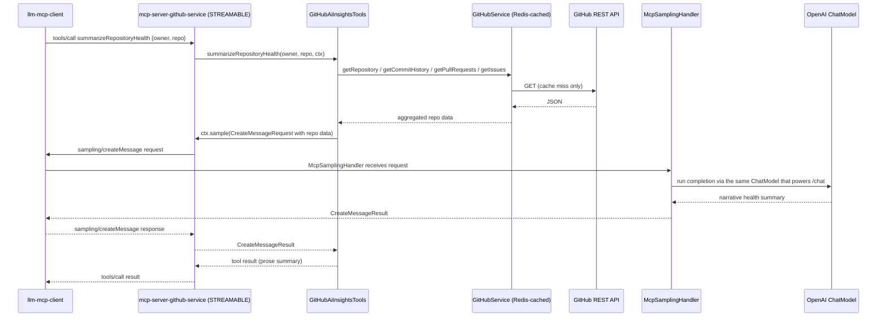

# GitHub Service — `mcp-server-github-service`

An MCP server that exposes GitHub repository intelligence (commits, PRs, issues, releases, workflow runs, …) as
tools for the `llm-mcp-client` assistant, backed by the GitHub REST API. Runs on **`:8085`**, MCP protocol
**STREAMABLE**, no datasource — it is a thin, stateless proxy over `api.github.com`.

---

## MCP Tools

Twelve plain tools are defined in `GitHubMcpTools` as `@McpTool`-annotated methods, auto-registered by Spring AI's
MCP annotation scanner (`McpServerAnnotationScannerAutoConfiguration`) — there is no `McpToolConfig` bean and no
`MethodToolCallbackProvider`:

| Tool name            | Type  | Description                                                                |
|----------------------|-------|----------------------------------------------------------------------------|
| `getRepository`      | READ  | Repository metadata — stars, forks, language, default branch, visibility   |
| `getCommitHistory`   | READ  | Paginated commit log for a branch (sha, message, author, date)             |
| `getCommitMetrics`   | READ  | Commit count / author / frequency stats over a `since`–`until` window      |
| `listBranches`       | READ  | Branches for a repository                                                  |
| `getPullRequests`    | READ  | Pull requests filtered by state (`open` / `closed` / `all`)                |
| `getIssues`          | READ  | Issues filtered by state and (optionally) labels                           |
| `getContributors`    | READ  | Top contributors for a repository                                          |
| `getWorkflowRuns`    | READ  | GitHub Actions workflow runs, optionally scoped to one workflow id         |
| `getReleases`        | READ  | Release listing for a repository                                           |
| `searchRepositories` | READ  | Repository search by query, sort and order                                 |
| `getCodeFrequency`   | READ  | Weekly additions/deletions ("code frequency") stats                        |
| `createIssue`        | WRITE | Create an issue (title, body, labels) — gated by `require-user-for-writes` |

A thirteenth tool, `summarizeRepositoryHealth`, is defined separately in `GitHubAiInsightsTools` (split out because
it injects `McpSyncRequestContext`, which only plain-tool-free classes can do cleanly). Instead of calling
`api.github.com` itself, it calls `ctx.sample(...)` — **MCP sampling** — asking the *connected client's* LLM to
write a narrative health summary from data the tool gathers, so the server never needs its own model API key:

| Tool name                   | Type | Description                                                                                                                 |
|------------------------------|------|------------------------------------------------------------------------------------------------------------------------------|
| `summarizeRepositoryHealth` | READ | Gathers repo metadata, recent commits, open PR/issue counts, then uses MCP sampling (`ctx.sample(...)`) to have the client's LLM write a prose health summary |

On the client, `McpSamplingHandler` (`@McpSampling(clients = "github")`) receives the resulting
`McpSchema.CreateMessageRequest`, runs it through the same `ChatModel` that powers `/chat`, and returns a
`McpSchema.CreateMessageResult` — the completion happens on the client's model, not a second one configured on the
server. Because this requires a stateful session, it only works because this server is **STREAMABLE**.

### MCP sampling flow for `summarizeRepositoryHealth`



---

## Best Practices Applied

| Practice                     | Status | Notes                                                                                                                                                                                          |
|------------------------------|--------|------------------------------------------------------------------------------------------------------------------------------------------------------------------------------------------------|
| Centralised error handling   | ✅      | `GlobalExceptionHandler` (`@RestControllerAdvice`) — uniform `{status, error, message, details, timestamp}` body                                                                               |
| Meaningful 404s              | ✅      | `ResourceNotFoundException` thrown from `GitHubService` on `HttpClientErrorException.NotFound` from the GitHub API                                                                             |
| Input validation             | ✅      | `requireNonBlank` guards on every tool (`owner`, `repo`, `since`, `until`, …) → `IllegalArgumentException` → HTTP 400                                                                          |
| Bearer token auth            | ✅      | `McpAuthFilter` validates `Authorization: Bearer <mcp.security.token>`; logs a `WARN` and runs in insecure dev mode if unset                                                                   |
| Acting-user propagation      | ✅      | `X-Acting-User` header → `ActingUserContext` thread-local, defaults to `mcp.security.default-user`                                                                                             |
| Write-operation gating       | ✅      | `enforceWriteGate` rejects mutating tools (`createIssue`) from the default user when `mcp.security.require-user-for-writes=true`                                                               |
| Rate limiting                | ✅      | In-memory per-user fixed-window limiter (`RateLimiter`, default 120 req/min) → HTTP 429                                                                                                        |
| Audit logging                | ✅      | Every tool call logs `TOOL <name>                                                                                                                                                              | user=… owner=… repo=… latencyMs=…` with outcome on success/error |
| Output truncation            | ✅      | `OutputSizeCapUtil.cap` truncates GitHub API responses beyond `mcp.output.max-chars` (default 8 000)                                                                                           |
| Externalised config          | ✅      | `GitHubProperties` / `SecurityProperties` (`@ConfigurationProperties`) — token, base URL, page size, security all env-overridable                                                              |
| GitHub API hygiene           | ✅      | `RestClient` sends `Accept: application/vnd.github+json` and `X-GitHub-Api-Version` per GitHub's versioning guidance; warns at startup if no token is configured (lower anonymous rate limits) |
| Structured logging           | ✅      | SLF4J/Lombok `@Slf4j`, application-tagged via `spring.application.name`                                                                                                                        |
| Distributed tracing          | ✅      | Micrometer Tracing → OTLP (`OTEL_EXPORTER_OTLP_ENDPOINT`) → Grafana Tempo                                                                                                                      |
| Prometheus metrics           | ✅      | `micrometer-registry-prometheus`, scraped at `/actuator/prometheus`, visualised in the `github-service-overview` Grafana dashboard                                                             |
| Liveness/readiness probes    | ✅      | `management.endpoint.health.probes.enabled: true`                                                                                                                                              |
| Health/auth allow-list       | ✅      | `/actuator/health` and `/actuator/info` are exempt from auth + rate limiting so orchestrators can probe the service                                                                            |
| Non-root container           | ✅      | Multi-stage Dockerfile runs as a dedicated `spring:spring` system user on a `jre`-only runtime image                                                                                           |
| Circuit breaker / resilience | ❌      | No Resilience4j *in this server*; the client-side `ResilientToolCallbackProvider` wraps every tool call to this server from the caller's side (circuit breaker `mcp-github`)                    |
| Caching                      | ✅      | Every `GitHubService` method is `@Cacheable(value = "github", key = "...")`; `GitHubClientConfig` is `@EnableCaching` with a `RedisCacheManager` — repeated queries for the same repo/params are served from Redis instead of re-hitting `api.github.com` |

---

## Design Patterns (GoF)

| Pattern                         | Where                                                                                                           | Role                                                                                                                                                                          |
|---------------------------------|-----------------------------------------------------------------------------------------------------------------|-------------------------------------------------------------------------------------------------------------------------------------------------------------------------------|
| **Template Method**             | `ToolExecutionTemplate` (`executeRead` / `executeWrite`)                                                        | The invariant tool-execution skeleton — resolve acting user, enforce write gate, audit log, cap output — is defined once; each `@Tool` method supplies only the business call |
| **Command**                     | `Supplier<String>` actions passed to `ToolExecutionTemplate`; `@Tool` methods wrapped as `ToolCallback` objects | The varying step is reified as an object the template executes                                                                                                                |
| **Proxy**                       | `@Cacheable` on `GitHubService` (Redis-backed AOP proxy); JPA-style dynamic proxying by Spring                  | Caching proxy intercepts calls and serves repeated GitHub queries from Redis                                                                                                  |
| **Facade**                      | `GitHubService`                                                                                                 | Hides GitHub REST API details (URIs, headers, 202-retry for async stats, error translation) behind simple methods                                                             |
| **Builder**                     | `RestClient.builder()`, `RedisCacheManager.builder()` in `GitHubClientConfig`                                   | Stepwise construction of configured clients                                                                                                                                   |
| **Factory Method**              | `@Bean` methods in `GitHubClientConfig` (`RestClient`, `RedisCacheManager`); `McpServerAnnotationScannerAutoConfiguration` builds each `@McpTool` method into a `SyncToolSpecification` | Container/framework builds and wires the REST client, cache manager, and tool registrations                                                                                                      |
| **Observer**                    | `@EventListener(ContextRefreshedEvent)` (`warnIfNoToken`)                                                       | Startup event subscription warns when no GitHub token is configured                                                                                                           |
| **Singleton**                   | All Spring beans                                                                                                | One shared, stateless instance per container                                                                                                                                  |
| **Template Method** (framework) | `McpAuthFilter extends OncePerRequestFilter`                                                                    | Framework skeleton calls `doFilterInternal` hooks                                                                                                                             |
| **Chain of Responsibility**     | Servlet `FilterChain`                                                                                           | Auth → rate-limit → tools, each link handles or passes on                                                                                                                     |

## Configuration

| Property / Env Var | Default | Description |
|-------------------------------=----------|----------------------------------|----------------------------------------------------------|
| `SERVER_PORT`                            | `8085`                           | HTTP port |
| `GITHUB_TOKEN` (`github.token`)          | *(empty → unauthenticated)*      | PAT/fine-grained token forwarded as
`Authorization: Bearer` to `api.github.com` |
| `github.api-base-url`                    | `https://api.github.com`         | GitHub REST API base URL |
| `github.default-page-size`               | `30`                             | `per_page` for paginated list
endpoints |
| `MCP_AUTH_TOKEN` (`mcp.security.token`)  | *(empty → insecure dev mode)*    | Shared bearer token required from MCP
clients |
| `mcp.security.default-user`              | `system`                         | Fallback acting user when
`X-Acting-User` is absent |
| `mcp.security.require-user-for-writes`   | `false`                          | Reject `createIssue` from the default
user when `true`   |
| `mcp.security.rate-limit-per-minute`     | `120`                            | Per-user fixed-window request cap |
| `mcp.output.max-chars`                   | `8000` *(see `OutputSizeCapUtil`)* | Max characters returned per tool
before truncation |
| `OTEL_EXPORTER_OTLP_ENDPOINT`            | `http://localhost:4318`          | OTLP traces endpoint (
Tempo)                             |
| `TRACING_SAMPLING`                       | `1.0`                            | Trace sampling probability |

---

## Running in Isolation

```bash
cd mcp-server-github-service
GITHUB_TOKEN=ghp_xxx MCP_AUTH_TOKEN=019ea153-01b5-73a3-9db1-ee5d05381838 docker compose up redis prometheus grafana github-service
```

This resolves the root compose file and brings up `redis` (`:6379`), `prometheus` (`:9090`) and `grafana`
(`:3000`, admin/admin, auto-loads the `github-service-overview` dashboard) alongside the service on `:8085`.
Or run it directly:

```bash
export GITHUB_TOKEN=ghp_xxx
./mvnw spring-boot:run
```

An Insomnia collection covering MCP discovery and every tool call for all services is provided at the repo root:
[`insomnia-collection.json`](../insomnia-collection.json).

---

## curl Commands

> MCP requests are JSON-RPC 2.0 over the streamable-HTTP endpoint `/mcp`. Replace `$TOKEN` with your
> `MCP_AUTH_TOKEN` (defaults to `019ea153-01b5-73a3-9db1-ee5d05381838` per `application.yaml`).

### List available tools

```bash
curl -s http://localhost:8085/mcp \
  -H 'Content-Type: application/json' \
  -H "Authorization: Bearer $TOKEN" \
  -d '{"jsonrpc":"2.0","id":1,"method":"tools/list"}'
```

### Repository metadata

```bash
curl -s http://localhost:8085/mcp \
  -H 'Content-Type: application/json' \
  -H "Authorization: Bearer $TOKEN" \
  -d '{
        "jsonrpc":"2.0","id":2,"method":"tools/call",
        "params":{"name":"getRepository","arguments":{"owner":"spring-projects","repo":"spring-boot"}}
      }'
```

### Commit history

```bash
curl -s http://localhost:8085/mcp \
  -H 'Content-Type: application/json' \
  -H "Authorization: Bearer $TOKEN" \
  -d '{
        "jsonrpc":"2.0","id":3,"method":"tools/call",
        "params":{"name":"getCommitHistory","arguments":{"owner":"spring-projects","repo":"spring-boot","branch":"main","page":1}}
      }'
```

### Commit metrics over a date range

```bash
curl -s http://localhost:8085/mcp \
  -H 'Content-Type: application/json' \
  -H "Authorization: Bearer $TOKEN" \
  -d '{
        "jsonrpc":"2.0","id":4,"method":"tools/call",
        "params":{"name":"getCommitMetrics","arguments":{"owner":"spring-projects","repo":"spring-boot","since":"2026-05-01","until":"2026-06-01"}}
      }'
```

### Branches

```bash
curl -s http://localhost:8085/mcp \
  -H 'Content-Type: application/json' \
  -H "Authorization: Bearer $TOKEN" \
  -d '{
        "jsonrpc":"2.0","id":5,"method":"tools/call",
        "params":{"name":"listBranches","arguments":{"owner":"spring-projects","repo":"spring-boot"}}
      }'
```

### Open pull requests

```bash
curl -s http://localhost:8085/mcp \
  -H 'Content-Type: application/json' \
  -H "Authorization: Bearer $TOKEN" \
  -d '{
        "jsonrpc":"2.0","id":6,"method":"tools/call",
        "params":{"name":"getPullRequests","arguments":{"owner":"spring-projects","repo":"spring-ai","state":"open"}}
      }'
```

### Issues by label

```bash
curl -s http://localhost:8085/mcp \
  -H 'Content-Type: application/json' \
  -H "Authorization: Bearer $TOKEN" \
  -d '{
        "jsonrpc":"2.0","id":7,"method":"tools/call",
        "params":{"name":"getIssues","arguments":{"owner":"spring-projects","repo":"spring-ai","state":"open","labels":"documentation"}}
      }'
```

### Contributors

```bash
curl -s http://localhost:8085/mcp \
  -H 'Content-Type: application/json' \
  -H "Authorization: Bearer $TOKEN" \
  -d '{
        "jsonrpc":"2.0","id":8,"method":"tools/call",
        "params":{"name":"getContributors","arguments":{"owner":"spring-projects","repo":"spring-boot"}}
      }'
```

### Workflow runs

```bash
curl -s http://localhost:8085/mcp \
  -H 'Content-Type: application/json' \
  -H "Authorization: Bearer $TOKEN" \
  -d '{
        "jsonrpc":"2.0","id":9,"method":"tools/call",
        "params":{"name":"getWorkflowRuns","arguments":{"owner":"spring-projects","repo":"spring-boot","workflowId":""}}
      }'
```

### Releases

```bash
curl -s http://localhost:8085/mcp \
  -H 'Content-Type: application/json' \
  -H "Authorization: Bearer $TOKEN" \
  -d '{
        "jsonrpc":"2.0","id":10,"method":"tools/call",
        "params":{"name":"getReleases","arguments":{"owner":"spring-projects","repo":"spring-boot"}}
      }'
```

### Search repositories

```bash
curl -s http://localhost:8085/mcp \
  -H 'Content-Type: application/json' \
  -H "Authorization: Bearer $TOKEN" \
  -d '{
        "jsonrpc":"2.0","id":11,"method":"tools/call",
        "params":{"name":"searchRepositories","arguments":{"query":"spring ai mcp","sort":"stars","order":"desc"}}
      }'
```

### Code frequency

```bash
curl -s http://localhost:8085/mcp \
  -H 'Content-Type: application/json' \
  -H "Authorization: Bearer $TOKEN" \
  -d '{
        "jsonrpc":"2.0","id":12,"method":"tools/call",
        "params":{"name":"getCodeFrequency","arguments":{"owner":"spring-projects","repo":"spring-boot"}}
      }'
```

### Create an issue (write — pass `X-Acting-User` if `require-user-for-writes` is enabled)

```bash
curl -s http://localhost:8085/mcp \
  -H 'Content-Type: application/json' \
  -H "Authorization: Bearer $TOKEN" \
  -H 'X-Acting-User: jane.doe' \
  -d '{
        "jsonrpc":"2.0","id":13,"method":"tools/call",
        "params":{"name":"createIssue","arguments":{
          "owner":"your-org","repo":"scratch-repo",
          "title":"MCP isolation test issue",
          "body":"Created via the github-service MCP tool while testing in isolation.",
          "labels":"test"
        }}
      }'
```

### Summarize repository health (MCP sampling — requires a client that implements `sampling/createMessage`)

```bash
curl -s http://localhost:8085/mcp \
  -H 'Content-Type: application/json' \
  -H "Authorization: Bearer $TOKEN" \
  -d '{
        "jsonrpc":"2.0","id":14,"method":"tools/call",
        "params":{"name":"summarizeRepositoryHealth","arguments":{"owner":"spring-projects","repo":"spring-boot"}}
      }'
```

> Calling this tool directly with `curl` will only succeed if the caller also implements the client side of MCP
> sampling; in this repo that role is played by `llm-mcp-client`'s `McpSamplingHandler`, not a plain HTTP client.

### Actuator

```bash
curl -s http://localhost:8085/actuator/health | jq
curl -s http://localhost:8085/actuator/prometheus | head -40
```
